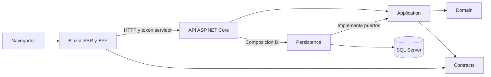
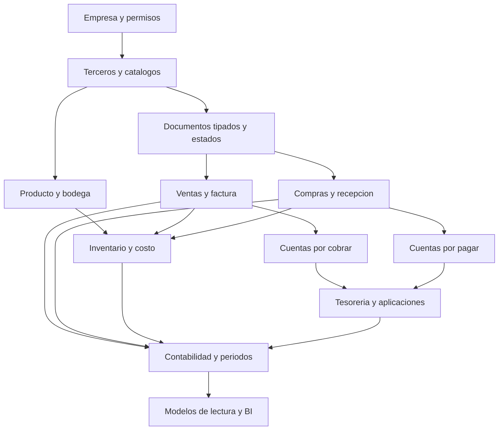

# NEROS ERP: diagnostico de arquitectura

Fecha: 2026-09-13. Linea base anterior a la primera iniciativa de este roadmap. Alcance: solucion Neros, fuentes de ejecucion, pruebas, configuracion, scripts y metadatos de NEROSERP local. No incluye una auditoria del sistema legacy del repositorio padre ni certifica produccion.

Nota de revision arquitectonica (2026-09-13): se conservan los hallazgos, conteos, limites y resultados historicos. Solo se corrigen recomendaciones futuras incompatibles con [ADR-0002: Distributed Modular ERP Platform](adr/ADR-0002-distributed-modular-platform.md), que sustituye ADR-0001. La base compartida descrita abajo es el estado encontrado, NO el destino aprobado. I-02 anterior queda detenida; la secuencia vigente usa D-01 en adelante en el roadmap revisado.

## 1. Estado actual

NEROS es una base funcional de acceso multiempresa en .NET 10, no un ERP transaccional completo. El flujo operativo comprobado es login, seleccion de empresa autorizada, inicio con empresa/rol/actividad personal y cierre revocable. El catalogo comercial del login y la lista de modulos del home son presentacion de capacidades futuras, no implementaciones.

La separacion de capas es aprovechable: Blazor no consulta SQL; la API delega en Application; Persistence implementa sus puertos. Domain y Shared aun contienen esencialmente placeholders. Los modelos persistidos estan en Persistence, no hay agregados de negocio en Domain. La evolucion aprobada separa bounded contexts en servicios autonomos con bases, contratos y despliegues propios, reutilizando acceso/UI y preservando datos durante la transicion; no amplia estas capas globales como destino.

### Evidencia y limites

- Graphify consultado primero: util como indice, pero advierte identificadores antiguos y ausencia de parser SQL. Sus nodos incluyen documentos e instrucciones; un nodo no demuestra una capacidad implementada.
- Inspeccion directa de proyectos, puntos de entrada, controladores, servicios, repositorio, contexto, modelos, SQL, rutas, componentes y JavaScript activos; busqueda de dependencias e implementaciones transversales.
- SQL local: consulta de solo lectura a sys.tables, sys.partitions y sys.indexes. Ocho tablas: una empresa, un usuario, una membresia, un claim, dos sesiones, doce eventos y ninguna fila en logins/tokens externos. Es una instantanea de desarrollo, no una carga representativa; no se leyeron contrasenas, hashes o valores de tokens.
- Suite completa de partida: 10/10 pruebas aprobadas en SQL temporal y Edge. Ver [pruebas](../tests/Neros.Tests/AccesoMultiempresaTests.cs) y [entorno](../tests/Neros.Tests/EntornoPruebas.cs).
- NuGet confirma Microsoft.OpenApi 2.0.0 vulnerable en API y Tests por dependencia transitiva; npm audit --omit=dev no reporta vulnerabilidades conocidas. Esto no sustituye auditoria de SDK, SO, todas las herramientas de desarrollo, secretos historicos o pentest.
- No se midieron carga concurrente, p95/p99, planes reales, bloqueos, fragmentacion, restores, alta disponibilidad, costos de nube ni cumplimiento fiscal. No hay evidencia que permita afirmar capacidad para 10.000 usuarios o cientos de millones de movimientos.

## 2. Modulos existentes

Completo significa completo para el flujo acotado descrito, no certificacion empresarial. Parcial tiene operaciones reales pero faltantes importantes; Inicial es infraestructura o presentacion sin el proceso de negocio completo; No existe significa sin implementacion encontrada en esta solucion.

| Area | Existe | Estado | Observaciones |
| --- | --- | --- | --- |
| Login y logout | Si | Completo | Identidad SQL, cookie BFF, errores sin recarga, revocacion; alcance del flujo actual |
| Seleccion y cambio de empresa | Si | Completo | Activas y autorizadas; no consolidacion |
| Empresas y administracion de usuarios | Si | Parcial | Alta inicial y asignaciones por CLI; sin CRUD administrativo ni invitaciones |
| Roles, permisos, segregacion | Si | Parcial | Rol textual de membresia y claim global; sin permisos por accion/sucursal ni SoD |
| Grupo, sucursal, sede, unidad, centro operativo/costo | No | No existe | La empresa no equivale a todas estas dimensiones |
| Home / centro de trabajo | Si | Inicial | Empresa, rol y ocho accesos propios; no tareas, aprobaciones ni KPIs |
| Auditoria | Si | Parcial | Eventos de acceso; sin campos antes/despues, IP, documento o correlacion persistida |
| Terceros y vistas 360 | No | No existe | No hay maestro cliente/proveedor/empleado |
| Catalogos, monedas, impuestos, consecutivos | No | No existe | No hay maestros ERP comunes |
| Documentos, estados y adjuntos empresariales | No | No existe | No hay motor ni agregados documentales |
| Contabilidad | No | No existe | Sin plan, periodos, comprobantes o libros |
| Tesoreria | No | No existe | Sin cajas, bancos, conciliacion o pagos |
| Cuentas por cobrar y pagar | No | No existe | Sin obligaciones, aplicaciones ni edades |
| Ventas y compras | No | No existe | Solo nombres comerciales con estado En preparacion |
| Inventario y costeo | No | No existe | Sin producto, bodega, kardex, promedio o FIFO |
| Activos y presupuesto | No | No existe | Sin depreciacion ni real/presupuesto/forecast |
| CRM | No | No existe | Sin lead, pipeline o actividad comercial |
| HCM / RRHH y nomina | No | No existe | Sin contratos ni liquidaciones; columnas Identity no son HCM |
| Produccion / MRP | No | No existe | Sin BOM, rutas, capacidad o ordenes |
| WMS, calidad y mantenimiento | No | No existe | Sin procesos operativos especializados |
| Proyectos | No | No existe | Sin tiempos, costos o rentabilidad |
| POS y e-commerce | No | No existe | Sin venta de caja ni canal externo |
| Workflows y motor de reglas | No | No existe | Sin configuracion, evaluacion o historial de decisiones |
| Centro de Procesos e importador/exportador | No | No existe | No hay worker, colas o trabajos persistidos |
| API empresarial | Si | Inicial | Endpoints de acceso/empresas sin versionado, OAuth/scopes o idempotencia |
| OpenAPI publicado | No | No existe | Hay dependencia de paquete, pero no AddOpenApi ni MapOpenApi |
| Integraciones y webhooks | No | No existe | Cliente HTTP interno BFF/API no es framework de integraciones |
| Buscador global | No | No existe | Filtro local de empresas no es busqueda global |
| Notificaciones / tiempo real | No | No existe | ReconnectModal de Blazor no es centro de notificaciones o hub de negocio |
| Low-Code | No | No existe | Sin campos, vistas o reglas configurables por cliente |
| Reportes / PDF / BI / IA | No | No existe | Red animada del login es decorativa, no inteligencia artificial |
| Localizacion fiscal e internacionalizacion | Si | Inicial | UI espanola, UTC y formato local; sin multimoneda, recursos por idioma ni DIAN |
| Observabilidad | Si | Inicial | Logs, ProblemDetails API y RequestId en pagina de error; sin health ni trazas integradas |

## 3. Arquitectura encontrada

### Solucion y dependencias

[Neros.slnx](../Neros.slnx) contiene ocho proyectos. Las carpetas src/Modules y src/Workers dentro de la solucion son agrupaciones virtuales, no modulos o workers implementados.

| Proyecto | Responsabilidad actual | Referencias propias |
| --- | --- | --- |
| Neros.Shared | Placeholder transversal | Ninguna |
| Neros.Domain | Placeholder de dominio | Shared |
| Neros.Contracts | DTOs de acceso y empresas, DataAnnotations | Shared |
| Neros.Application | IServicioIdentidad, IRepositorioEmpresas, ServicioEmpresas | Domain, Contracts, Shared |
| Neros.Persistence | EF SQL Server, Identity, sesiones y repositorio | Application; acceso a Contracts transitivo |
| Neros.Api | Composicion DI, controladores, autenticacion bearer opaca y CLI | Application, Persistence, Contracts, Shared |
| Neros.Blazor | SSR, BFF, cookie, cliente HTTP y UI | Contracts, Shared |
| Neros.Tests | Integracion SQL y navegador | Api, Blazor |

Es una aplicacion por capas con dos hosts web; todavia no hay limites de modulos de negocio verificables. Esta topologia es evidencia historica. La decision actual exige limites de servicios y ownership independiente, no solo carpetas de modulos dentro del mismo proceso.

### Codigo propietario y contratos

- [ServicioEmpresas](../Neros.Application/Autenticacion/ServicioEmpresas.cs) orquesta listado, seleccion y home; repite alguna comprobacion por defensa, sin reglas financieras.
- [RepositorioEmpresas](../Neros.Persistence/Seguridad/RepositorioEmpresas.cs) decide acceso por membresia activa o claim global en cada consulta.
- [ServicioIdentidad](../Neros.Persistence/Seguridad/ServicioIdentidad.cs) usa UserManager/SignInManager; persiste hash del token y audita en SQL.
- [ContratosAcceso](../Neros.Contracts/Autenticacion/ContratosAcceso.cs) no expone entidades EF. AccesoConcedido contiene un token para el canal servidor a servidor; no debe reutilizarse como respuesta BFF al navegador.
- [EndpointsSesion](../Neros.Blazor/Servicios/EndpointsSesion.cs) emite cookies y valida antiforgery. JSON de login devuelve estados; 204 inicia navegacion; sin JS mantiene POST convencional.
- [ClienteNeros](../Neros.Blazor/Servicios/ClienteNeros.cs) encapsula HTTP y no consulta persistencia.

### API y errores

Rutas reales: POST api/acceso/login, GET api/acceso/yo, POST api/acceso/logout, GET api/empresas, POST api/empresas/{id}/seleccionar y GET api/empresas/{id}/inicio. Existe tambien WeatherForecast, residuo de template cubierto por la politica autenticada por defecto. No es modulo del ERP.

API tiene ApiController, validacion automatica y ProblemDetails para excepciones. Blazor combina mensajes por estado, excepciones HTTP y pagina Error de template en ingles. No hay catalogo uniforme de errores de negocio ni correlacion visible y persistida de punta a punta. Un cambio de permisos entre comprobacion y escritura puede terminar en UnauthorizedAccessException/500; antes de operaciones financieras hay que definir atomicidad y traduccion de conflictos.

### Frontend y JavaScript

Rutas activas login, empresas y home, ademas de error/not-found. Tailwind 3.4.17, Lucide local, Manrope externa, temas sistema/claro/oscuro. La navegacion mejorada esta desactivada; el login ahora usa fetch sin recargar al rechazar credenciales. El selector y la salida siguen siendo POST completos.

theme-init.js prepara apariencia; experience.js gestiona formulario, tema, clave, recordatorio de correo, fechas y filtro; login-network.js define un canvas decorativo con pausa, reduced-motion y limpieza de recursos. No hay framework JS empresarial adicional. No se encontro Bootstrap/jQuery en el flujo activo. Los componentes Features/Auth del prototipo y las hojas CSS con ambito huerfanas (MainLayout, NavMenu, Home, Login) se eliminaron el 2026-09-25; el login vigente es Pages/Login.razor.

Hay registro de interactividad Server y ReconnectModal, pero las paginas de negocio revisadas operan en SSR; no hay hub SignalR de negocio. La UI reutiliza Icono, SelectorTema, layouts y estilos; aun faltan tabla paginada, filtros de servidor y formularios de maestros.

## 4. Base de datos

[Contexto](../Neros.Persistence/NerosDbContext.cs), [modelo](../Neros.Persistence/Seguridad/ModeloSeguridad.cs) y [script inicial](../database/scripts/001_identity_empresas.sql) concuerdan en las ocho tablas observadas.

| Tabla | Clave / relacion | Indices y observaciones |
| --- | --- | --- |
| AspNetUsers | PK Id nvarchar(450) | UserNameIndex unico filtrado; EmailIndex no unico; Activo, SecurityStamp y ConcurrencyStamp Identity |
| AspNetUserClaims | PK entero; FK usuario cascade | Indice UserId; privilegio global almacenado aqui |
| AspNetUserLogins | PK proveedor + clave; FK usuario cascade | Sin flujo SSO configurado aunque exista tabla |
| AspNetUserTokens | PK usuario + proveedor + nombre | Sin flujo MFA configurado aunque exista tabla |
| Empresas | PK Guid | Codigo unico; identificacion fiscal no unica; sin pais, moneda o rowversion |
| UsuariosEmpresas | PK usuario + empresa; ambas FK restrict | Indice EmpresaId; Rol texto y Activo |
| Sesiones | PK hash varchar(64); FK usuario cascade | Indices Expira y UsuarioId; sello, expiracion; token original no almacenado |
| EventosAcceso | PK bigint; FK usuario/empresa opcionales restrict | Indices EmpresaId y usuario/empresa/fecha; sin detalle de cambios |

No hay tablas AspNetRoles/AspNetUserRoles: se usa IdentityUserContext, no IdentityDbContext con roles completos. No hay filtro global de empresa: el aislamiento actual depende de consultas explicitas del repositorio. No se encontro rowversion o control de concurrencia para Empresa/membresia. Tampoco tablas de migracion, historial de scripts, outbox o idempotencia.

El script 000 crea la base si falta; 001 crea el esquema una sola vez, con transaccion y SET requeridos para indices filtrados. No ejecutar 001 en una base con datos. Las pruebas usan EnsureCreated/EnsureDeleted exclusivamente sobre NerosTests_GUID: verifican el modelo, no que un upgrade SQL manual conserve datos. Falta prueba separada de instalacion/actualizacion de scripts y registro de version/checksum.

La documentacion propone limpieza de sesiones vencidas mediante job administrado, pero no se encontro job desplegado. Los eventos no tienen politica de retencion implementada. Las FK restrict ayudan, pero no constituyen por si solas auditoria legal inmutable.

## 5. Seguridad

### Controles existentes

- Identity verifica contrasenas con hash; minimo configurado de 12 caracteres para altas, cinco fallos y bloqueo de 15 minutos. Login acepta claves mas cortas para rechazarlas genericamente, no para crear cuentas.
- Usuario inexistente ejecuta verificacion senuelo; no elimina todos los canales temporales posibles ni reemplaza pentest.
- Token opaco aleatorio de 256 bits; SQL guarda SHA-256, expiracion y sello. Revocacion por logout, cambio de sello, inactividad y bloqueo. Duracion 8 horas o 7 dias.
- BFF guarda token en cookie protegida por Data Protection, HttpOnly, SameSite Lax, Secure fuera de Development. No lo entrega a JS; antiforgery en los POST de sesion.
- API autenticada por defecto, empresa autorizada en servidor y respuesta 404 a recursos ajenos. Pruebas cubren membresia revocada, empresa inactiva y administrador global.
- Limites por IP: API 60/min y BFF 10/min. No son cuotas empresariales distribuidas ni proteccion completa contra ataques.
- Secretos fuera de appsettings versionados; claves de configuracion auditadas sin mostrar valores. HTTPS exigido en el cliente API fuera de desarrollo y HSTS en produccion.

### Brechas y riesgos

1. No hay permisos consultar/crear/editar/aprobar/exportar ni sucursales. Administrador, Operador y Consulta son etiquetas actuales, no politicas equivalentes a esas acciones.
2. AdministradorGlobal accede a todas las empresas activas. Falta definir frontera tenant/grupo comercial: no desplegar clientes independientes en un mismo ambito global sin esa decision y sus pruebas.
3. Sin MFA, SSO/OIDC, recuperacion autoservicio, invitaciones, gestion de sesiones o administracion de permisos desde UI. Tablas/campos Identity no equivalen a implementacion.
4. Data Protection persistida/compartida/protegida, proxy confiable, hosts, certificados, identidad SQL de minimo privilegio y restore no estan acreditados como despliegue productivo.
5. API ve la IP del BFF; varios usuarios pueden compartir su limite de 60/min. Detras de proxy, BFF tambien puede agrupar usuarios. No confiar indiscriminadamente en X-Forwarded-For: definir proxies conocidos y cuotas por sujeto.
6. No se comprobo explotabilidad remota de OpenAPI en Neros. El paquete vulnerable esta presente; no hay lector ni endpoint encontrado que procese documentos OpenAPI no confiables.
7. Auditoria insuficiente para operaciones financieras, cambios de privilegios o segregacion de funciones. No hay control de acceso especifico a un visor de auditoria porque ese visor no existe.

No se encontro una vulnerabilidad critica confirmada dentro del alcance. Esto no declara el sistema libre de vulnerabilidades ni listo para produccion.

## 6. Rendimiento y escala

| Observacion | Evidencia | Riesgo y siguiente comprobacion |
| --- | --- | --- |
| Empresas sin paginacion | ListarAsync termina en ToListAsync tras filtrar y proyectar | Correcto para volumen actual; introducir pagina limite y orden estable antes de listados masivos |
| Actividad limitada | Where + OrderByDescending + Take(8) + Select | Reutilizable; futuro cursor por Fecha e Id para historial completo |
| Claims consultados dentro de proyeccion | Subconsultas Any y rol First | No es N+1 de viajes por fila; medir SQL/plan antes de cachear o agregar indice de claims |
| Revalidacion de sesion | Cookie llama api/acceso/yo; cada llamada API valida sesion SQL | Varios viajes por pagina; medir latencia/p95 y conservar revocacion inmediata |
| Dobles verificaciones de empresa | Servicio y repositorio comprueban autorizacion | Defensa actual; futura unidad transaccional y consulta autorizada para escrituras |
| CLI abre transaccion antes de pedir datos | ComandosAdministracion con Serializable e interaccion humana | Bloqueos largos durante aprovisionamiento; recoger/validar entrada antes de transaccion corta |
| Eventos y sesiones crecen | Sin worker/retencion | Limpieza por lotes y politica con evidencia de retencion antes de produccion |
| Sin carga representativa | Una empresa y pocas filas locales | No decidir particiones/Redis/DW por intuicion; definir dataset y objetivos medibles |

No se encontraron Include, lazy loading configurado, SQL concatenado, FromSql ni bloqueo .Result/.Wait en el codigo activo examinado. El ToList sincronico de claims en BFF opera sobre claims en memoria, no sobre una tabla SQL. Las APIs Identity usadas no todas exponen CancellationToken; el repositorio y HTTP si lo propagan. La CLI usa consola sincronica por ser una operacion humana local, no un proceso masivo dentro de HTTP.

## 7. Deuda tecnica priorizada

| ID | Severidad | Hallazgo | Tratamiento |
| --- | --- | --- | --- |
| DT-01 | Alta | Microsoft.OpenApi 2.0.0 vulnerable, introducido por paquete no utilizado | Primera iniciativa: retirar dependencia no utilizada, restaurar y auditar todo el arbol |
| DT-02 | Alta | Frontera tenant/grupo y permisos por accion sin resolver | Condicion previa a administrar clientes y documentos |
| DT-03 | Alta | Operacion productiva no acreditada: claves, backups/restore, proxy, privilegios | Checklist y ensayo en staging antes de comercializar |
| DT-04 | Alta | Rate limit por IP BFF/API puede agrupar clientes | Prueba concurrente y politica por cliente/sujeto con proxies confiables |
| DT-05 | Media | Auditoria limitada y concurrencia insuficiente para maestros futuros | Auditoria estructurada y rowversion al introducir escrituras administrativas |
| DT-06 | Media | Errores heterogeneos y sin correlacion operacional integral | Codigos de negocio, ProblemDetails, trazabilidad y health checks acotados |
| DT-07 | Media | Sin CI .yml/.yaml de build/test encontrada en Neros | Hay documentos de workflows, no pipeline ejecutable acreditado; raiz Git esta arriba |
| DT-08 | Media | Scripts sin registro/checksum ni prueba de upgrade; pruebas solo modelo EF | Harness de scripts en base temporal y migracion expand/contract |
| DT-09 | Media | Transaccion interactiva de CLI y usuarios sin administracion normal | Acortar transaccion y sustituir gradualmente por casos autorizados |
| DT-10 | Media | Sin paginacion del listado y retencion automatizada | Habilitar al crecer, no materializar tablas enteras de maestros |
| DT-11 | Baja | Class1, WeatherForecast y componentes Auth de prototipo | Limpieza verificada posterior, no confundirlos con capacidades |
| DT-12 | Baja | Documentacion residual contradictoria | database/README afirma rol solo empresarial, pero ya existe claim global; actualizar al tocar aprovisionamiento |
| DT-13 | Baja | Error de template en ingles, estilos residuales y fuente externa | Unificar UX de errores y revisar despliegue de recursos |
| DT-14 | Baja | Grafo con IDs antiguos y SQL no indexado | Mantener evidencia primaria en fuente; reconstruccion controlada separada |

No se clasifican como deuda todos los modulos inexistentes: son brechas de producto deliberadas, no bugs. La ausencia de Kafka o Redis no es un defecto. Los servicios autonomos, eventos fiables y bases independientes ahora son brechas frente al destino aprobado por ADR-0002, no capacidades que esta auditoria haya encontrado implementadas.

## 8. Brechas frente a la vision de 73 secciones

| Secciones | Situacion encontrada | Fundamento requerido |
| --- | --- | --- |
| 1-3, 45-46 | Capas y empresa existentes; modularidad y jerarquia pendientes | Limites de modulo, tenant, permisos y maestros |
| 4, 44, 57-58 | Sin documentos, eventos o asientos | Agregados por proceso, transacciones, idempotencia y reversos |
| 5-14 | Sin circuito ERP financiero/comercial | Terceros, moneda, catalogos, documentos y contabilidad minima |
| 15-23 | Sin CRM/HCM/nomina/operaciones avanzadas | Circuito Core estable y datos confiables |
| 24-28 | Sin workflows, reglas o procesos/importacion/exportacion | Autorizacion, documentos y jobs persistidos |
| 29-31 | Solo API interna no versionada | Contratos publicos, scopes, outbox, conectores y webhooks seguros |
| 32-37 | Sin buscador, 360, low-code, BI ni IA | Permisos composables, datos operativos y modelos de lectura |
| 38-43 | Sin evidencia de escala grande | Paginacion, indices guiados por planes, medicion, retencion y lectura analitica separada |
| 47-50 | UI espanola/UTC, Identity parcial | Tenant, moneda/pais, localizaciones, SoD, SSO/MFA |
| 51-54 | Login/empresa/home reales; sin centro de tareas o telemetria completa | Patrones UI y errores, eventos de negocio, correlacion |
| 55-60 | Secretos separados y docs; sin operacion productiva validada | Deployment, CI, contratos, auditoria y ADRs |
| 61-73 | Vision y priorizacion, no implementacion | Roadmap por entregables y gates; ediciones comerciales sin bifurcar codigo |

No se hizo benchmark funcional independiente de Siigo/Odoo/SIESA/Sage/Novasoft/QuickBooks/Oracle/SAP. Son referencias competitivas, no una prueba de paridad. La [estrategia existente](gerencial/estrategia-comercial-producto.md) conserva sus supuestos y fuentes; las nuevas familias comerciales propuestas requieren reconciliarse con ella antes de cotizar.

## 9. Componentes reutilizables

Reutilizar UserManager/SignInManager y sesiones revocables donde el proveedor de identidad sea compatible; el patron BFF de cookie y antiforgery; ClienteNeros y DTOs como adaptadores de transicion; politica de autorizacion por recurso; TimeProvider; proyecciones AsNoTracking; SQL manual transaccional; fixture SQL aislada y pruebas de acceso; componentes Icono/SelectorTema/layouts; aviso accesible y estados de envio. Migrar identidad y empresa al propietario exclusivo con un solo escritor; no mantener copias operativas duplicadas ni compartir sus tablas entre servicios.

## 10. Refactorizaciones necesarias

1. Separar Organization e Identity con bases propias, referencias externas por ID y corte de ownership ensayado. Conservar IDs, cuentas y comportamiento; no trasladar todo Identity a Domain ni hacer renames destructivos por estetica.
2. Introducir permisos y ambito de empresa como caso autorizado reusable. No convertir ServicioEmpresas en un servicio universal de reglas.
3. Separar mensajes de negocio, errores tecnicos y trazabilidad; reducir codigo del formulario solo cuando mas formularios compartan el patron.
4. Crear nuevos dominios como servicios con capas internas, contratos, scripts y pipelines propios desde su primer flujo. Retirar capas globales solo tras migrar sus consumidores; no compartir DbContext ni esperar saturacion para separar despliegues.
5. Sustituir administracion CLI progresivamente, conservando recuperacion controlada y cuentas existentes. Eliminar prototipos despues de verificar usos, no junto a un cambio de seguridad.

## 11. Roadmap tecnico

Orientacion futura corregida por ADR-0002: I-01 conserva su cierre; D-01 define foundation y contratos; D-02/D-04 introducen Gateway/BFF compatible, errores/OTel, bus, Outbox/Inbox, containers y CI/CD independientes; D-05/D-07 separan Identity/Organization y SaaS; D-08/D-11 prueban el primer vertical de terceros/pedido/reserva; despues llegan Jobs, Finance y Core. Atomicidad dentro de cada propietario, consistencia eventual/sagas entre servicios, nunca posting global por transaccion compartida. Secuencia exacta y gates en el [roadmap](NEROS_ERP_IMPLEMENTATION_ROADMAP.md).

## 12. Roadmap funcional

Orientacion futura corregida: foundation distribuida y acceso SaaS primero; terceros/cliente/producto/cotizacion/pedido/reserva como primera vertical real, sin factura ni credito financiero. Tras su gate de eventos/autonomia: Jobs, Finance minimo y venta/cartera/recaudo, luego compra/CxP/pago; workflow/integraciones/notificaciones y Data Platform independiente. Gestion, HCM/nomina/proyectos, produccion/MRP/WMS y capacidades analiticas avanzadas siguen segun segmento y dependencias. No construir modulos vacios ni interpretar plataforma/eventos como infraestructura que llega solo despues del Core.

## 13. Dependencias funcionales

Las flechas representan dependencias de informacion/proceso, no referencias bidireccionales entre proyectos ni acceso SQL entre servicios. En el destino distribuido se materializan con APIs/eventos y estados conciliables. Contabilidad minima debe existir antes de publicar una factura contabilizada; no se construye al final para reparar movimientos previos.

## 14. Riesgos y bloqueos

| Riesgo | Impacto | Mitigacion / gate |
| --- | --- | --- |
| Vender modulos anunciados como operativos | Alto comercial | Estados verificables y demostracion solo de flujos habilitados |
| Confundir multiempresa con multitenant | Fuga entre clientes | ADR de aislamiento y pruebas negativas antes del segundo cliente independiente |
| Generalizar documentos en una mega tabla | Deuda alta | Agregados tipados, capacidades compartidas y trazabilidad por referencia |
| Contabilizacion o costo sin reversibilidad | Inconsistencia financiera | Invariantes, periodo, idempotencia, transaccion y reverso probado |
| Legislacion sin validacion profesional | Fiscal/legal | Localizacion versionada y especialista por jurisdiccion; no prometer DIAN por tener PDF |
| Dependencias entre ediciones mal interpretadas | Arquitectura fragmentada | Una plataforma de servicios autonomos sin forks por edicion; derechos comerciales separados de permisos |
| Datos legacy no evaluados | Migracion larga o perdida | Perfilado, mapeo, ensayos, conciliacion y rollback antes de importar |
| Copias, credenciales o claves no recuperables | Interrupcion y perdida | Restore medido y claves protegidas antes de produccion |
| Escala prometida sin pruebas | Saturacion y costos | Dataset sintetico, SLO y pruebas de concurrencia por flujo |
| Amplitud de alcance frente a capacidad de equipo | Entregas inconclusas | Una iniciativa verificable a la vez, responsables y gates de negocio |

## Fuentes y seguimiento

- [Arquitectura objetivo](NEROS_ERP_TARGET_ARCHITECTURE.md) y [roadmap de implementacion](NEROS_ERP_IMPLEMENTATION_ROADMAP.md).
- [Configuracion y secretos](tecnica/configuracion-y-secretos.md), [acceso actual](tecnica/acceso-multiempresa.md), [validacion](tecnica/validacion.md), [SQL](../database/README.md).
- [Aviso GHSA-v5pm-xwqc-g5wc / CVE-2026-49451](https://github.com/advisories/GHSA-v5pm-xwqc-g5wc), consultado 2026-09-13: denegacion de servicio al analizar referencias circulares OpenAPI; ramas corregidas 2.7.5 y 3.5.4. No acredita explotacion en Neros.

El cierre de la iniciativa I-01 se registra en el roadmap; este diagnostico conserva la evidencia anterior para distinguir lo encontrado de lo corregido.