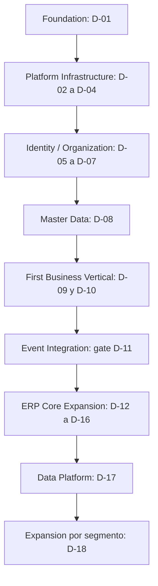

# NEROS ERP: roadmap de plataforma distribuida

Fecha: 2026-09-13. Decision vigente: [ADR-0002](adr/ADR-0002-distributed-modular-platform.md), con [arquitectura distribuida](NEROS_ERP_TARGET_ARCHITECTURE.md) y [diagnostico historico](NEROS_ERP_ARCHITECTURE_ASSESSMENT.md). **I-02 anterior: DETENIDA, no implementar con el plan anterior.** I-01 conserva su cierre historico; I-02 a I-15 quedan sustituidas como secuencia por D-01 en adelante. No son trabajo completado por renombrarlas.

La revision inicial fue documental; la autorizacion posterior inicia ejecucion secuencial D-01..D-18. Consultar [estado y evidencia actuales](execution/NEROS_EXECUTION_STATUS.md), [contratos D-01](execution/D01_FOUNDATION_CONTRACTS.md) y [ADR-0003](adr/ADR-0003-foundation-development.md). No hay fechas o capacidad prometidas; sin commit/push.

## 1. Orden y fundamento en el repositorio

Event Integration es el ensayo completo y endurecimiento del flujo, NO posponer Event Bus hasta D-11. Outbox/Inbox, contratos, observabilidad y despliegue se implementan antes del primer productor/consumidor real. El primer vertical solo se considera entregado al superar D-11. Su funcionalidad empieza despues de una foundation ejecutable, no despues de quince proyectos vacios.

Evidencia revalidada para esta revision: NerosDbContext agrupa usuarios/sesiones/empresas/membresias/eventos; las membresias y eventos tienen FK a usuarios/empresas. RepositorioEmpresas usa Identity/claims en SQL; BFF usa DTOs de acceso compartidos. Domain/Shared son principalmente placeholders y no hay ventas, stock o ledger que migrar. Por eso se separa Organization primero mediante contratos y un adaptador de identidad actual, luego Identity con corte de cuentas/sesiones ensayado. No crear dos DbContext contra las mismas tablas ni permitir SQL de Organization a Identity.

La solucion/Visual Studio y login se conservan durante transicion. Los nuevos dominios nacen directamente como servicios con bases y pipelines propios. No se replica la estructura global por comodidad ni se reescribe el frontend. Baseline anterior: diez pruebas de acceso aprobadas, no evidencia de distribucion o carga.

## 2. Top 10 y reglas de prioridad

Impacto y dificultad son escala ordinal 1-5, no dias ni ROI. Prioridad y dependencias prevalecen: ninguna extraccion precede seguridad, ownership y migracion probada. Orden exacto por gates; dentro de un gate se pueden preparar artefactos independientes, pero no saltar su salida.

| Orden / ID | Objetivo | Horizonte / prioridad | Impacto | Dificultad | Dependencias | Riesgo principal |
| --- | --- | --- | --- | --- | --- | --- |
| 1 / D-01 | Cerrar contratos de foundation, threat model, decisiones tecnicas y plan de corte | NOW P0 | 5 | 3 | ADR-0002 y auditoria | Ambiguedad de seguridad/ownership |
| 2 / D-02 | Gateway/BFF compatible y patron ejecutable de servicio, error/health/OTel | NOW P0 | 5 | 3 | D-01 | Introducir bypass o romper login |
| 3 / D-03 | Broker piloto, IEventBus, Outbox/Inbox y recuperacion demostrable | NOW P0 | 5 | 4 | D-01/D-02 | Perdida, duplicacion o ACK prematuro |
| 4 / D-04 | Contenedores, discovery y pipeline reusable por servicio | NOW P0 | 5 | 4 | D-02/D-03 | Release conjunto oculto, secretos, restores no probados |
| 5 / D-05 | Extraer Organization con base propia y compatibilidad BFF | NOW P0 | 5 | 5 | D-01 a D-04 | FK/claims compartidos, permisos perdidos |
| 6 / D-06 | Identity independiente y OIDC/MFA/recovery con migracion controlada | NOW P0 | 5 | 5 | D-05 y proveedor elegido D-01 | Bloqueo de cuentas, cambio silencioso de revocacion |
| 7 / D-07 | Aprovisionamiento SaaS, roles por ambito y operacion de tenant | NOW P0 | 5 | 4 | D-05/D-06 | Fuga tenant, escalada global, provision parcial |
| 8 / D-08 | Master Data real: tercero, roles y catalogos minimos | NEXT P1 | 5 | 3 | D-07 | Duplicacion/PII y snapshots incorrectos |
| 9 / D-09 | Inventory real: producto/bodega/existencia piloto y reserva | NEXT P1 | 5 | 4 | D-08 y politicas de reserva | Sobreventa por concurrencia y apertura no conciliada |
| 10 / D-10 | Sales real: cliente comercial, cotizacion y pedido conectado | NEXT P1 | 5 | 4 | D-08/D-09 | Confirmado confundido con reservado |

D-11 es gate P0 obligatorio de D-10, no mejora opcional desplazada por estar fuera de las diez primeras posiciones. No iniciar Finance/facturas para ocultar defectos del primer vertical.

## 3. Foundation y Platform Infrastructure: ejecucion exacta

| ID | Entregable concreto y proyectos | Impacto de datos / migracion | Gate de salida |
| --- | --- | --- | --- |
| D-01 | Catalogo de APIs/eventos v1 por propietario; TenantContext/SecurityContext; IEventBus/IOutbox/Inbox; errores/OTel/health; threat model; decisiones OIDC, broker piloto y discovery; actualizar instrucciones de capas al autorizar implementacion | Inventario FK/eventos/claims, mapeo tenant inicial y propietario por tabla, plan expand/migrate/contract; ninguna DDL todavia | Revision conjunta de contratos, SLA de revocacion/convergencia, plan de recuperacion admin y roles; ADRs de proveedor/tecnologia aprobados |
| D-02 | Neros.Gateway candidato YARP, BFF actual via rutas compatibles, primer host Organization con endpoint tecnico protegido y patrones de template; OTel/ProblemDetails/resiliencia/health desde aqui | Sin mover datos aun; Organization no lee NEROSERP; contratos de identidad transitorios explicitos | Login/empresas/logout actuales iguales; headers/tenant falsificados rechazados, errores sanitizados, trace HTTP, health sin secretos y rate limits coherentes |
| D-03 | Adaptador de UN broker piloto (RabbitMQ propuesto), abstraccion IEventBus, Outbox/Inbox por base y dispatcher; pruebas en almacenamiento temporal del template Organization | Scripts tecnicos locales por servicio, no tabla central de bus; fixture de productor/consumidor es prueba, no servicio de negocio vacio | Caida pre/postcommit, duplicado simultaneo, desorden, lease, confirm/ack, DLQ/replay; efecto exactamente una vez por clave funcional sin prometer entrega exactly-once |
| D-04 | Docker/registry por host, discovery por nombres logicos, AppHost Aspire candidato o Compose justificado; CI reusable Build/Test/Containerize/Scan/Deploy/Rollback | Registro/checksum SQL y ensayo instalacion/upgrade/restore por base; identidades separadas runtime/migracion, secretos externos | Dos versiones compatibles de host con despliegue independiente; contratos y scripts probados; sin Development/secretos en imagen; aislamiento SQL/red y OTel exportado a backend real de piloto |

El template es el patron extraido del primer host y sus pruebas, no generador universal ni proyecto por entidad. D-02 puede tener brevemente endpoint tecnico mientras se valida infraestructura; D-05 debe darle responsabilidad real antes de replicar la plantilla en otros dominios. Jobs/Workflow/Finance no se crean vacios en D-02.

Foundation define desde D-01 los contratos de Gateway, BFF, Service Template, Contracts, Identity, Organization, Event Bus, Outbox, Inbox, Observability, Error Model, Tenant Context, Security Context, Health, CI/CD y Containerization. D-02/D-04 los hacen ejecutables; D-05/D-07 aportan datos reales y aislamiento. La decision de SaaS no se vuelve a posponer como pregunta de arquitectura.

## 4. Identity / Organization: ownership y corte

### D-05: Organization independiente

Crear Neros.Organization.Api/Application/Domain/Infrastructure/Contracts y Worker de eventos con NerosOrganization/OrganizationDbContext. Reutilizar reglas/validaciones de ServicioEmpresas, no referenciar global Application/Persistence. Tenant/grupo/empresa/sucursal/membresia/permisos pertenecen aqui; usuarios, credenciales y sesiones permanecen temporalmente en el origen Identity actual.

1. Ensayar sobre copia aislada: clasificar Empresas, UsuariosEmpresas y EventosAcceso; preservar IDs y origen de eventos; acordar tenant inicial y traduccion de AdministradorGlobal. No convertirlo automaticamente en acceso a todos los tenants.
2. Preparar scripts propios, snapshot/backfill idempotente y reconciliacion de conteos/claves. Herramienta de migracion temporal con permisos especiales, nunca runtime multibase. Nuevas referencias SubjectId sin FK externa.
3. Ofrecer contrato de estado/autorizacion de identidad actual por adaptador autenticado, con token validado y ambito explicito; Organization no confia en headers internos ni consulta AspNetUsers. Revocacion actual se conserva hasta SLA aprobado.
4. Pausar escrituras administrativas, drenar delta, revocar escritor antiguo de datos Organization y habilitar nuevo escritor. Rutas api/empresas antiguas delegan por HTTP. Auditar seleccion/entrada en Organization, autenticacion en Identity; actividad home conserva sus resultados mediante proyeccion autorizada.
5. Validar y reabrir; retirar lecturas SQL cruzadas y CLI que escriba ambas propiedades. Si se vuelve atras tras nuevas escrituras, reconciliar delta inverso antes de habilitar origen; nunca dos escritores activos.

Gate: usuario existente sigue entrando, empresas/roles/actividad equivalentes; pruebas de revocacion y aislamiento entre dos tenants, scripts upgrade/restore reales, denegacion SQL a la base ajena, contrato Identity indisponible con comportamiento fail closed y release independiente Organization. Sin gate, no avanzar.

### D-06: Identity independiente

Crear Neros.Identity.Api/Application/Infrastructure/Contracts y dispatcher cuando publique revocaciones; base NerosIdentity/IdentityDbContext. Proveedor OIDC se elige en D-01 con prueba de hashes, subject, sesiones, logout/recovery/MFA, licencia y operacion; no escribir servidor OAuth casero. Reutilizar Identity/UserManager y controles actuales donde sean compatibles.

Migrar usuarios/claims de identidad/logins/tokens/sesiones/eventos de autenticacion con mapping de subject estable y sin exponer secretos. Ensayar sellos, bloqueo, cookie BFF, Data Protection y expiraciones. Corte de credenciales y sesiones con un escritor y backup/rollback. Si proveedor no permite conservar sesiones, aprobar reautenticacion programada sin reset masivo de claves. Rutas api/acceso siguen mediante adaptador compatible durante ventana de transicion; tokens opacos legacy se validan solo en ese canal acotado, no se aceptan como tokens OAuth generales.

Gate: diez escenarios actuales de acceso mantienen cobertura equivalente, MFA/recovery/admin, token audience/scope/issuer invalidos rechazados, identidad de servicio y delegacion probadas, logout/revocacion con SLA aprobado, Identity caida sin bypass. Retirar NerosDbContext y hosts/capas globales SOLO cuando no queden consumidores/ownership; no renombrarlos como kernel. NEROSERP anterior se archiva/retiene segun plan aprobado, no se borra por este roadmap.

### D-07: administracion SaaS operativa

Tenant -> grupo -> empresa -> sucursal; unidad/centro y permisos por accion; Platform/Tenant/Company Administrator distintos, SoD y auditoria. Provision Tenant tiene estados Solicitado/Provisionando/Activo/Error, claves idempotentes y comandos por propietario; no transaccion distribuida. Tenant no se habilita hasta recursos/permisos requeridos confirmados. Reintento/compensacion no elimina datos existentes.

Gate: segundo tenant real de prueba aislado en APIs/jobs/archivos/logs; desactivacion y revocacion con backlog, quotas/noisy neighbor, decision sensible sin IAM disponible, recovery admin auditada, restore tenant y ensayo de routing shared/dedicated. Flags por tenant no reemplazan permisos. No ofrecer dedicated productivo hasta ensayar su ciclo completo.

## 5. Master Data y primer vertical real

| ID | Alcance funcional / proyectos | Migracion y contratos | Gate |
| --- | --- | --- | --- |
| D-08 | Neros.MasterData: tercero persona/organizacion, identificador por pais, rol base cliente/proveedor, catalogos minimos y listado paginado | Base propia; datos nuevos, sin importar legacy; ThirdPartyChanged.v1/RoleAssigned, Outbox, snapshots y tombstones | Duplicado normalizado/conflicto ETag, permisos/PII, alta de tercero desde BFF, proyeccion reconstruible |
| D-09 | Neros.Inventory: producto operativo, bodega, unidades, existencia inicial de piloto y comandos/reservas | Base propia; ProductChanged.v1, APIs disponibilidad asOf, reserva unica por pedido/linea y compensacion | Concurrencia sobre ultimo stock, duplicado/desorden/cancelacion/expiracion, ningun escritor de stock externo |
| D-10 | Neros.Sales: habilitacion cliente comercial por empresa, cotizacion, lineas/precios/snapshot, pedido y saga de reserva | Base propia; consume terceros/productos autorizados; SalesOrderConfirmed.v1 y resultados Inventory via Outbox/Inbox | Usuario crea tercero/cliente/producto/cotizacion/pedido y ve reserva/rechazo con operationId; dos tenants; despliegue Sales independiente |

Primera vertical = **Tercero -> Cliente -> Producto -> Cotizacion -> Pedido -> Reserva**. Tercero/rol base vive en Master Data; condiciones comerciales en Sales; producto operativo en Inventory. No tres tablas Cliente con la misma identidad. Cambios maestros no recalculan snapshots historicos.

Alcance inicial no fiscal y sin credito financiero: cotizacion/pedido/reserva, no factura ni CxC. Existencias iniciales son datos de piloto/ensayo autorizados, no saldos productivos sin conciliacion y contrapartida contable; habilitar apertura real exige D-13/D-14. No hacer llamadas a un Finance inexistente ni inventar disponibilidad de credito. SoD minima por politica aplica sin esperar motor configurable.

### D-11: gate de Event Integration y autonomia

Prioridad P0 NEXT, impacto 5, dificultad 4; depende D-08/D-10. No introduce recien aqui el bus: demuestra el circuito con infraestructura real antes de aceptar la vertical.

- APIs versionadas y schemas de eventos probados productor/consumidor, SQL/broker reales y pruebas E2E BFF. Ningun servicio usa DbContext, credenciales o tablas de otro.
- Reiniciar Sales entre commit y publish; Inventory entre commit y ACK; repetir evento y commandId, cambiar payload con misma clave, retrasar confirmacion hasta despues de cancelacion, DLQ/replay. Cero doble reserva/perdida no reconciliada.
- Caida del bus deja pedido pendiente y Outbox recuperable; timeout no equivale a rollback. Saga reconcilia, libera o solicita intervencion con motivo visible.
- Traza HTTP/evento y correlationId conectan todos los pasos; errores y logs sin secretos/PII. Probar tenant/actor falsificado, token incorrecto, revocacion y evento de productor no autorizado.
- Desplegar Sales v2 con Inventory v1, rollback compatible, pausar Master Data y operar con proyeccion dentro de TTL; fuera de validez se rechaza. Escalar Inventory sin cambiar Sales ni futuros Payroll/Finance.
- Carga piloto, p95 de consulta/convergencia, lag, costo, cuota y noisy neighbor; SLO aprobados antes de medicion. Imagen/SQL/contratos pasan pipeline de cada servicio.

Entrega aceptada solo con evidencia de estos resultados y demonstracion funcional, no con carpetas, mocks o diagramas. No ejecutar estas pruebas contra datos de clientes.

## 6. NEXT: Jobs y expansion ERP Core

| Orden / ID | Objetivo | Prioridad | Impacto | Dificultad | Dependencias | Riesgo / gate |
| --- | --- | --- | --- | --- | --- | --- |
| 12 / D-12 | NEROS Jobs + importacion/exportacion real de terceros; pools por dominio | P1 | 4 | 4 | D-08/D-11, storage privado | Lease/retry/DLQ/cancelacion/progreso/quota; reinicio no duplica items; Jobs sin SQL ajeno |
| 13 / D-13 | Finance minimo: plan, periodos, GL, CxC/CxP, Treasury y posting local | P0 | 5 | 5 | D-11, moneda/impuestos/centros y responsable contable | DbContext/base propia; balance debito=credito, periodo cerrado, reverso, idempotencia de origen, script/restore |
| 14 / D-14 | Factura Sales -> Finance; despacho/costo Inventory -> Finance; recaudo/aplicacion | P1 | 5 | 5 | D-13 y politicas fiscales/credito/costo | Inbox + CxC + asiento atomicos solo en Finance; costo/factura fuera de orden, rechazo/compensacion/reconciliacion; no anunciar posting completo antes de confirmacion |
| 15 / D-15 | Purchasing: orden -> recepcion -> factura proveedor -> CxP -> pago | P1 | 5 | 5 | D-14 y proveedor/SoD | Recepciones/pagos parciales, anticipo/reverso, unico propietario stock/ledger, compra no escribe Finance |
| 16 / D-16 | Workflow, Integration y Notification, cada uno con primer caso real | P1 | 4 | 4 | D-12/D-15 | Orden interno: aprobacion versionada -> conector fiscal sandbox -> resultado notificado; no despliegue conjunto obligatorio |

D-12 construye Jobs.Api/Worker y su base, mas worker Master Data que posee importacion. API -> Job/Outbox -> Queue -> Worker Pool -> Progress/Result. Ninguna API procesa archivo masivo en request; ningun worker Jobs referencia Domain de todos los servicios. Costeo/conciliacion/cierre/facturacion masiva llegan luego como workers del propietario con los mismos contratos, no como plugins con acceso universal.

D-13 primero valida Finance aisladamente con comandos/eventos de prueba autorizados. D-14 integra los hechos reales: InvoiceIssued no equivale a InvoicePosted ni FiscalDocumentAccepted. Rechazo contable exige reparacion/reconciliacion; timeout externo requiere consulta por clave estable. CxC/Treasury/GL permanecen juntos inicialmente para sus invariantes locales, preparados para extraccion futura, no como bases globales.

Antes de facturacion electronica real: proveedor/localizacion, certificado/secretos, sandbox y asesoria; pruebas de reintento y consulta de estado. Integration aplica HMAC/timestamp/eventId para webhooks, rotacion, DLQ y defensa SSRF (HTTPS, destinos privados/metadata bloqueados, DNS/redirect/egreso controlados). Notification recibe datos minimos y reautoriza deep link. Aprobar un pago requiere SoD minima incluso antes de Workflow configurable; D-16 no posterga controles obligatorios.

## 7. LATER: Data Platform y dominios avanzados

| Orden / iniciativa | Objetivo | Impacto / dificultad | Dependencias | Gate / riesgo |
| --- | --- | --- | --- | --- |
| D-17a Analytics | Eventos/CDC/ETL de propietarios -> warehouse -> dashboards/reporting | 5 / 4 | D-14/D-16, datos conciliados | Linaje, watermarks, late events, retencion, aislamiento, costo; sin BI pesado en OLTP |
| D-17b Search | Indexacion desacoplada por eventos, ACL/tombstones/version y vistas 360 | 4 / 4 | D-17a y contratos indexables | Sin joins distribuidos por consulta; reconstruccion y revocacion medidas, frescura visible |
| D-18a Gestion | CRM, activos/presupuesto y Projects segun cliente objetivo | 4 / 4 | Core estable, ledger y maestros | CRM junto a Sales inicialmente si cohesion; activos/presupuesto en Finance hasta justificar limite; Projects propio con primer flujo |
| D-18b HCM / Payroll | Empleo/novedades/nomina por pais, pagos y contabilizacion | 5 / 5 | Master Data/Finance/Jobs y especialista | Datos sensibles segregados, calculo versionado, simulacion/SoD, no acceso a PII por rol cliente |
| D-18c Production / MRP | BOM/rutas/capacidad, orden, consumos/terminados y costo | 5 / 5 | Inventory/Purchasing/Finance confiables | Mensajes idempotentes, conciliacion de consumo/costo y demanda real |
| D-18d WMS / calidad / mantenimiento | Ejecucion logistica y operativa por contextos cohesionados | 4 / 5 | D-18c o caso logistica validado | WMS no crea segundo ledger de stock; offline solo con protocolo aprobado |
| D-18e Canales/localizaciones | POS/e-commerce; Mexico/USA despues del alcance Colombia | 4 / 5 | Sales/Inventory/Finance/Integration | Pagos/stock no duplicados, sandbox y especialista por jurisdiccion, sin fork ERP |
| D-18f ML/IA/low-code | Forecast/anomalias o asistente autorizado, vistas/reglas acotadas | 3 / 5 | D-17, datos y evaluacion | Backtesting/costo/PII, confirmacion humana, no SQL/codigo libre ni bypass contable |

Orden base de D-18 es a -> b -> c -> d -> e -> f; puede repriorizarse con ADR/decision de producto para el segmento elegido sin omitir dependencias. No estimar fechas sin equipo y mercado. Data Platform puede preparar contratos en D-01, pero su primer despliegue funcional llega con datos reconciliados; no significa acceso de Analytics a todas las bases antes de D-17.

## 8. Gates transversales y pruebas de capacidad

Cada servicio tiene build/test/image/scan/deploy/rollback independiente, contratos hacia atras y scripts expand/migrate/contract. Cambios de contrato disparan pruebas de compatibilidad, no despliegue en bloque. Shared kernel tecnico minimo y versiones compatibles, sin entidades EF/repositorios/reglas de modulos. Nuevos servicios se crean al empezar su ID del roadmap, no todos durante Foundation.

Cada escritura requiere tenant/accion/recurso, validacion de entrada, concurrencia, auditoria local, idempotencia y prueba negativa. Cada productor/consumidor necesita Outbox/Inbox antes de recibir trafico real. Cada importacion/job necesita quota, autorizacion al ejecutar, lease/checkpoint, cancelacion/reintento, progreso/resultado, DLQ y limpieza. Cada despliegue productivo necesita TLS, secrets externos, health, trazas, backups/restore, RPO/RTO, runtime SQL minimo y rollback.

Pruebas de autonomia y escala por fases de la arquitectura: piloto 2 tenants/50 usuarios; intermedia 20 tenants/1.000 usuarios; objetivo progresivo 100+ tenants, 1.000+ empresas y 10.000+ concurrentes con millones de maestros/documentos y cientos de millones de movimientos. Estas cifras NO estan demostradas. Definir RPS, mezcla/think time, dataset, picos, soak, limites de error/convergencia y costo por tenant antes de ensayar. Publicar resultado con hardware, replicas, indices y limitaciones.

Escalar Inventory x10 sin Payroll, Sales v3 sin desplegar Finance/Inventory/Production y mover Analytics sin tocar operaciones son criterios de aceptacion, no promesas por usar containers. Probar hot SKU, noisy neighbor, broker/SQL failover y migracion shared->dedicated; no ocultar backlog mediante respuestas 202 rapidas. Detener servicios temporales al terminar verificaciones locales.

## 9. Que se conserva y que se crea

Conservar ahora Neros.Blazor, Neros.Api, Neros.Application, Neros.Persistence, Neros.Contracts, Neros.Domain, Neros.Shared, Neros.slnx y tests/Neros.Tests. La matriz de la arquitectura especifica destino y retiro por propietario; conservar no significa ampliarlos como backend global. Login/empresa/home, DTOs actuales y pruebas son el puente de compatibilidad; tablas y cuentas no se destruyen para cambiar nombres.

Creacion por gate: D-02 Gateway y primer host Organization; D-03 abstracciones/adaptador mensajeria y dispatcher; D-04 AppHost/config/pipelines/containers; D-05 capas y base Organization reales; D-06 Identity; D-08 Master Data; D-09 Inventory; D-10 Sales; D-12 Jobs; D-13 Finance; D-15 Purchasing; D-16 Workflow/Integration/Notification; D-17 Analytics/Search; D-18 otros contextos con flujo real. Los workers pertenecen al servicio y se agregan cuando hay mensajes/jobs propios. Neros.Observability se extrae solo para configuracion tecnica realmente repetida; no catalogo gigante de servicios.

Cada nuevo dominio usa Neros.<Servicio>.Api, Domain, Application, Infrastructure y Contracts, con Worker cuando corresponda; Identity no necesita Domain vacio. Scripts por modulo en database/<modulo> aplicados con tools/Neros.Database.Deploy (ADR-0004), tests por servicio y E2E de plataforma; no crear carpetas sin contenido. El arbol detallado esta en la seccion 15 de la arquitectura. No se han creado estos proyectos en esta revision.

## 10. Decisiones y lista de aplazamiento

| Decision | Se cierra en | Restriccion |
| --- | --- | --- |
| OIDC/proveedor y compatibilidad de credenciales/sesiones | D-01, ensayo definitivo D-06 | No auth server casero, no reset de cuentas por defecto |
| Broker piloto/libreria y topologia | D-01, POC D-03 | RabbitMQ propuesto; ASB si Azure; no Kafka por escala teorica |
| Cloud/broker productivo/secret store/registry | D-04 antes de piloto externo | Containers y contratos no sustituyen evaluacion costo/residencia/operacion |
| SLA revocacion/convergencia y SLO de carga | D-01/D-07, medidos D-11 | No degradar controles actuales ni vender escala no ensayada |
| Tenant inicial, claims, ownership de eventos y rollback | D-01/D-05 | SaaS ya decidido; preservar IDs, no dos escritores |
| Fiscalidad, credito, costeo y periodos | Antes D-13/D-14 | Especialista, snapshots y reconciliacion; no requisitos legales inventados |

Aplazar Kubernetes obligatorio, Kafka sin caso de streaming, service mesh por defecto, event sourcing/CQRS universal, servicio por tabla, low-code libre, IA sin evaluacion, multinacional sin experto, POS offline y conectores sin sandbox. NO aplazar bases independientes, contratos, seguridad interservicios, eventos fiables, OTel o deploy independiente: son foundation. No interpretar minimizar proyectos como objetivo arquitectonico.

Core/Professional/Enterprise/Platform pueden seguir como empaquetado comercial sobre capacidades, nunca forks o releases conjuntos obligatorios. Reconciliar precios/nombres con la estrategia comercial en una revision separada; no declarar nuevas ediciones disponibles por escribir este roadmap.

## 11. Trazabilidad del roadmap anterior

| Plan anterior | Tratamiento vigente |
| --- | --- |
| I-01 dependencia vulnerable | Completada; evidencia historica conservada abajo |
| I-02 errores/health/rate limits | DETENIDA como iniciativa anterior; requisitos incorporados en D-01/D-02/D-04, aun no implementados |
| I-03 CI / I-07 auditoria y SQL | D-04 y controles obligatorios por servicio desde D-05 |
| I-04 tenant / I-05 administracion | SaaS ya decidido; D-05/D-07 implementan ownership y permisos |
| I-06 terceros / I-08 documentos | D-08/D-10, servicios y bases independientes |
| I-09 Core | D-13/D-15, integracion eventual; ninguna transaccion global |
| I-10 jobs / I-11 workflow / I-12 notificaciones | D-12/D-16, pools propietarios y contratos |
| I-13 API / I-14 outbox | API/Outbox/Inbox pasan a Foundation D-01/D-04, no fase tardia |
| I-15 busqueda | D-17b desacoplada, sin joins distribuidos |

## 12. I-01: cierre historico conservado

Completada y verificada el 2026-09-13 ANTES de esta correccion arquitectonica. Se retiro de [Neros.Api.csproj](../Neros.Api/Neros.Api.csproj) solo Microsoft.AspNetCore.OpenApi no utilizado que introducia Microsoft.OpenApi 2.0.0 vulnerable. Sin cambios de rutas, contratos, tablas, cookies o UI por esa iniciativa.

Evidencia registrada entonces: restore desde nuget.org correcto, ambos paquetes ausentes en assets API/Tests, auditoria NuGet de solucion sin vulnerabilidades conocidas en la fuente consultada, build correcto y 10/10 pruebas aprobadas. No se silencio NU1903; el editor conservaba un diagnostico previo. No se acredito explotabilidad remota de OpenAPI ni ausencia absoluta de vulnerabilidades. No aplicar scripts a NEROSERP, recrear cuentas o reintroducir paquete vulnerable para volver atras.

Este cierre no demuestra pruebas actuales de microservicios ni escala. OpenAPI con dependencia mantenida se introduce con las APIs versionadas reales en Foundation. La siguiente accion propuesta es revisar/cerrar D-01 tras aceptar esta documentacion; **no continuar I-02 ni implementar modulos funcionales en esta entrega**.