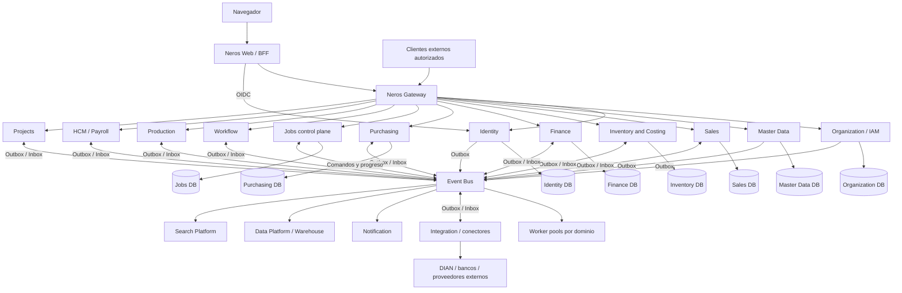
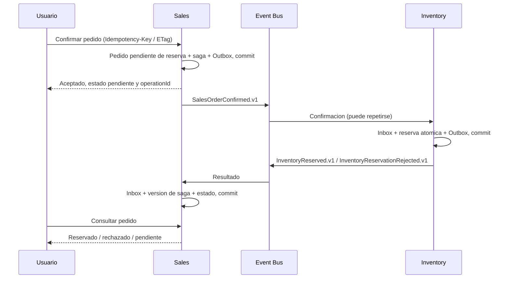
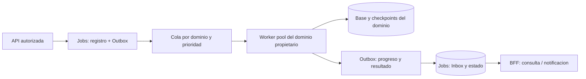
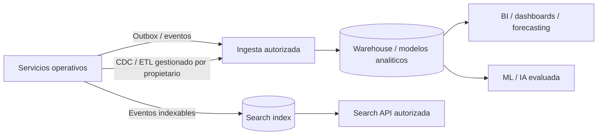

# NEROS ERP: arquitectura objetivo distribuida

Fecha: 2026-09-13. Decision vigente: [ADR-0002: Distributed Modular ERP Platform](adr/ADR-0002-distributed-modular-platform.md). Sustituye la propuesta monolitica anterior. Este documento describe el destino, no certifica implementacion ni capacidad. La autorizacion posterior inicia ejecucion: consultar [estado y evidencia](execution/NEROS_EXECUTION_STATUS.md), no inferir funcionalidad desde el diseno. I-02 anterior queda detenida. Evidencia del origen en el [diagnostico historico](NEROS_ERP_ARCHITECTURE_ASSESSMENT.md); secuencia y gates en el [roadmap](NEROS_ERP_IMPLEMENTATION_ROADMAP.md).

## 1. Decision y restricciones

NEROS es una Distributed Modular ERP Platform, SaaS multi-tenant, basada en DDD, bounded contexts, servicios autonomos, contratos versionados y eventos. Cada contexto puede evolucionar, desplegarse, escalarse y alojarse independientemente desde su primera implementacion. La distribucion no queda condicionada a que falle un monolito.

Un servicio posee reglas, datos, tablas, scripts manuales, contratos y eventos. Su Domain permanece puro; Application coordina casos locales; Infrastructure implementa puertos; API y workers son hosts. Ningun servicio referencia Application, Domain, EF o repositorios de otro. Contratos publicados son esquemas/API/eventos con versiones compatibles, no ensamblados obligatoriamente actualizados en bloque.

No hay backend ERP universal, DbContext global, base compartida entre servicios, FK externa, joins entre bases, linked servers ni credenciales con acceso transversal. Es valido compartir instancia SQL, cluster de broker o infraestructura, nunca propiedad de tablas. Las copias autorizadas son proyecciones derivadas, no segundos propietarios. No se permiten cadenas sincronicas extensas, despliegues lockstep o Jobs como escritor universal: serian un monolito distribuido.

Los contextos son grandes por cohesion e invariantes, no un servicio por tabla. Los limites siguientes son propuesta concreta inicial, revisable mediante ADR, contratos y migracion; no una orden de crear todos los proyectos ahora.

## 2. Diagrama de servicios



Se omiten bases de capacidades futuras en el diagrama por legibilidad: TODAS las capacidades persistentes tienen almacenamiento propio segun la matriz siguiente. Workers comparten base solo con el servicio al que pertenecen; nunca acceden a las bases de otros dominios. Event Bus transporta, no calcula reglas. OTel atraviesa todas las flechas; no es un servicio de negocio del diagrama.

## 3. Bounded contexts y ownership de datos

| Servicio / contexto | Propiedad exclusiva | Base / contexto EF propuesto | Referencias o proyecciones externas | Limite y evolucion |
| --- | --- | --- | --- | --- |
| Identity | Credenciales, MFA, identidad externa, sesiones, recovery, politicas de identidad, eventos de autenticacion | NerosIdentity / IdentityDbContext | SubjectId estable, estado de identidad | Sin permisos de empresa; proveedor OIDC probado |
| Organization / IAM | Tenant, grupo, empresa, sucursal, unidad, centro de costo, membresias, roles, permisos, delegacion | NerosOrganization / OrganizationDbContext | SubjectId y proyeccion minima de estado Identity | Platform/Tenant/Company Admin separados; centro organizativo aqui, reglas de imputacion en Finance |
| Master Data | Tercero persona/organizacion, identificaciones, contactos/direcciones comunes, roles base cliente/proveedor; catalogos de referencia | NerosMasterData / MasterDataDbContext | Ambito de Organization; no credenciales ni nomina | No producto operativo ni todas las configuraciones; referencias de pais/moneda/UDM |
| Sales | Perfil comercial cliente por empresa, precios, descuentos, cotizacion, pedido, factura comercial, numeracion propia y saga de cumplimiento | NerosSales / SalesDbContext | TerceroId, ProductId; snapshots autorizados y versionados; credito de Finance | Sin stock, CxC o ledger propio; CRM puede iniciar como subdominio y separarse con demanda |
| Purchasing | Perfil de compra proveedor, solicitud, comparativo, orden, documento de recepcion comercial y factura proveedor | NerosPurchasing / PurchasingDbContext | TerceroId, ProductId, confirmacion de movimiento Inventory | Recepcion comercial no escribe kardex; sin CxP propia |
| Inventory & Costing | Producto operativo/variantes, bodegas, ubicaciones, existencias, reservas, movimientos, kardex, lotes, seriales, valuacion y corridas de costo | NerosInventory / InventoryDbContext | PedidoId, recepcionId, centros y origen; eventos de costo | WMS futuro separa tareas de ejecucion, no duplica autoridad sobre stock |
| Finance | GL, CxC, CxP, Treasury, plan, periodos, obligaciones, pagos, aplicaciones, posting, conciliacion | NerosFinance / FinanceDbContext | FacturaId, terceroId y snapshots; costos externos | Subdominios internos separados; GL/AR/AP/Treasury/Tax extraibles por contrato si se justifica |
| Workflow | Definiciones/versiones de aprobacion, instancias, delegaciones de proceso y decisiones | NerosWorkflow / WorkflowDbContext | Documento/version/importe, politicas de Organization | Aprobar no significa contabilizar; propietario del documento valida decision |
| Jobs | Trabajo, items de coordinacion, prioridades, quotas, leases, progreso, intentos, cancelacion, resultados referenciados | NerosJobs / JobsDbContext | Recursos/commandId de dominios, referencias privadas a archivos | Control plane durable; sin reglas contables ni acceso SQL ajeno |
| Integration | Conectores, inbox externos, suscripciones/webhooks, intentos, claves externas y reconciliacion de entregas | NerosIntegration / IntegrationDbContext | Documentos de origen y resultados fiscales/bancarios | Traduce modelos externos; no contabiliza ni emite factura comercial por su cuenta |
| Notification | Preferencias, destinatarios autorizados, mensajes, entregas y lectura | NerosNotification / NotificationDbContext | Eventos minimos, enlace autorizado | No copia indiscriminada de PII o documentos |
| Production | BOM/rutas/versiones, ordenes, capacidad, ejecucion y declaracion de terminado | NerosProduction / ProductionDbContext | Reserva/consumo/costo Inventory, compra Purchasing | MRP requiere fuentes confiables; calidad/mantenimiento se delimitan con flujo real |
| HCM / Payroll | Empleo, contrato, novedades, calculos/periodos y liquidacion por pais | NerosPayroll / PayrollDbContext | TerceroId; asientos/pagos confirmados por Finance | Datos laborales privados, no expuestos por permisos de terceros |
| Projects | Proyecto, tareas, tiempos, compromisos y modelo operativo de rentabilidad | NerosProjects / ProjectsDbContext | Referencias de compra/venta/costo/ledger | No replica saldos como verdad financiera |
| Analytics / Data Platform | Ingesta, watermarks, linaje, modelos analiticos, warehouse y datasets | Almacen analitico propio; EF no obligatorio | Eventos/CDC/ETL autorizados | Nunca escribe OLTP; computo y almacenamiento independientes |
| Search Platform | Indice, checkpoints, versiones, tombstones y ACL de documentos indexables | Indice y metadatos propios; EF no obligatorio | Eventos indexables minimizados | Sin joins distribuidos por busqueda |
| Gateway / Web BFF | Routing/politicas de borde; sesion web y composicion de vista respectivamente | Sin base de negocio; store de sesion/config si se requiere | APIs y tokens del destinatario | Ninguna regla, tabla o saldo ERP |

Dentro de cada base son validas FK, transacciones e indices. Referencias externas usan IDs estables mas TenantId/EmpresaId cuando corresponda, version y snapshot del hecho emitido. Desactivaciones se propagan; el propietario retiene historia y no borra un tercero/producto referenciado sin politica. Las proyecciones registran origen, version y antiguedad; no se modifican desde un CRUD local.

Money usa decimal y precision/redondeo acordados; moneda de transaccion/funcional, tasa/fecha/fuente quedan en snapshots. UTC para eventos, fecha contable y zona empresarial explicitas. Documentos tipados por contexto, no mega tabla ni RegistroDocumento central obligatorio en cada escritura. Un registro global futuro es proyeccion para consulta. Numeracion atomica unica por ambito legal dentro del propietario, nunca MAX+1 sin control. Rowversion/ETag y claves idempotentes protegen cambios concurrentes.

## 4. Matriz de comunicacion

| Origen -> destino | Sincrona: motivo y respuesta | Asincrona: contrato versionado | Regla de fallo / autonomia |
| --- | --- | --- | --- |
| Browser -> BFF -> Gateway | HTTP, cookie/CSRF; consultas y aceptacion de comandos | Actualizacion de estado por notificacion/polling | No exponer tokens a JS; 202 no significa trabajo terminado |
| BFF -> Identity | OIDC/login/recovery y refresh; introspeccion solo si el modelo lo necesita | IdentityDisabled.v1, SessionRevoked.v1 | Fail closed al autenticar; no convertir token opaco actual en JWT por rename |
| Servicio -> Organization | Decision fresca para accion sensible, seleccion/provision de ambito | MembershipChanged.v1, PermissionChanged.v1, CompanyDisabled.v1 | Proyeccion con version/TTL para consultas; sensible se deniega si no se puede validar |
| Sales -> Master Data | Alta/consulta paginada del tercero cuando el usuario la necesita | ThirdPartyChanged.v1, ThirdPartyRoleAssigned.v1 | Snapshot local para operar; no llamada por cada linea |
| Sales -> Inventory | Disponibilidad orientativa inmediata con asOf/version | SalesOrderConfirmed.v1 -> InventoryReserved.v1 o InventoryReservationRejected.v1 | Consulta no garantiza reserva; solo Inventory asigna atomicamente |
| Sales -> Inventory | Consulta de estado por reservationId para reconciliar | ReleaseInventoryReservation.v1 (comando), InventoryReservationReleased.v1, InventoryReservationExpired.v1 | Dedupe y version de saga; liberacion tardia no revive pedido cancelado |
| Sales -> Finance | Evaluacion/reserva de credito cuando politica lo exige | InvoiceIssued.v1 -> InvoicePosted.v1 o InvoicePostingRejected.v1 | Cotizacion no depende de Finance; emitir a credito exige autorizacion vigente |
| Inventory -> Finance | Consulta excepcional de estado de contabilizacion | InventoryCostValued.v1, InventoryCostAdjusted.v1 -> CostPosted.v1 | Factura y costo pueden llegar fuera de orden; Finance correlaciona por origen |
| Purchasing -> Inventory / Finance | Consultas acotadas de producto/estado | GoodsReceiptConfirmed.v1, SupplierInvoiceAccepted.v1 | Recepcion, stock y CxP tienen estados y reconciliacion propios |
| Finance -> consumidores | Consultas de obligaciones y saldos autorizados | PaymentReceived.v1, PaymentApplied.v1, AccountingEntryReversed.v1 | Recaudo y aplicacion no son sinonimos; no duplicar asiento por evento repetido |
| Dominio -> Workflow | Solicitar/consultar aprobacion con version | ApprovalRequested.v1, ApprovalGranted.v1, ApprovalRejected.v1 | Propietario compara version/monto/SoD antes de transicionar |
| API -> Jobs -> workers de dominio | Crear job 202; consultar/cancelar por ID | ExecuteJobBatch.v1, JobProgressed.v1, JobCompleted.v1 | Comando dirigido y autorizado; ninguna tabla ajena accesible |
| Dominio -> Integration -> externo | Consulta externa idempotente para resolver resultado ambiguo | FiscalSubmissionRequested.v1, FiscalDocumentAccepted.v1 o Rejected.v1 | No reintentar emision/cobro a ciegas; reconciliar clave externa |
| Production -> Inventory / Finance | Consulta acotada de materiales/capacidad financiera | ProductionCompleted.v1, MaterialConsumptionRequested.v1 | Consumo real lo confirma Inventory; finalizacion productiva no implica posting completo |
| Dominios -> Notification / Search / Data | Lectura de su propia API por usuarios autorizados | Hechos confirmados y proyecciones indexables versionadas | Retraso visible, replay autorizado, ninguna dependencia inversa para guardar un pedido |

REST/JSON es el protocolo inicial por interoperabilidad y diagnostico; gRPC se introduce para un contrato interno de alta frecuencia o streaming medido, con deadline, autenticacion y compatibilidad equivalentes. No imponer ambos a cada servicio. Routing interno mediante nombres logicos/configuracion; llamadas servicio-servicio no necesitan volver al gateway publico, pero SI pasan identidad y autorizacion del receptor.

Evitar fan-out no acotado y cadenas Sales -> Inventory -> Finance -> Organization. Consultas usan modelos locales derivados cuando pueden tolerar antiguedad. Los comandos sensibles explicitan el costo de decision fresca. Toda dependencia sincrona tiene presupuesto de latencia y comportamiento ante caida.

## 5. Event Bus y contratos

| Opcion | Adecuacion | Decision |
| --- | --- | --- |
| RabbitMQ | Colas/comandos, pub-sub, routing, piloto portable y desarrollo local | Propuesta inicial: exchanges/eventos y colas durables por consumidor, quorum en HA, publisher confirms y ack manual; POC valida operacion y recuperacion |
| Azure Service Bus | Mensajeria gestionada, queues/topics, DLQ y sesiones cuando se requieran | Alternativa de produccion si se selecciona Azure y se validan costo, cuotas, orden y residencia; no asumir equivalencia total con RabbitMQ |
| Kafka | Log particionado, alto caudal, replay y multiples consumidores analiticos | No baseline de comandos ERP; evaluar para Data Platform con necesidad medida |

Elegir UN broker para el primer vertical. El puerto no elimina diferencias operativas: un cambio de broker exige pruebas de conformidad y corte de colas, no cambiar una cadena de conexion. Evaluar libreria .NET madura, licencia, soporte y compatibilidad net10 antes de fijar el adaptador. No construir framework de mensajeria propio completo.

Contrato tecnico propuesto, aun sin archivos C#:

```text
Application.Messaging
  IEventBus.PublicarAsync(EnvelopeIntegracion mensaje, CancellationToken cancelacion)
  Publicar confirma aceptacion durable del broker; NO ejecucion de consumidores.
  IOutbox.Agregar(EnvelopeIntegracion mensaje) participa en la transaccion local.
  IComandosRemotos.EnviarAsync(destinoLogico, comandoVersionado, cancelacion)
  No hay nombres fisicos de colas/exchanges en Domain o casos de negocio.
```

Los casos de uso NO llaman IEventBus despues de guardar como unica garantia: agregan Outbox en su unidad de trabajo. El dispatcher de infraestructura usa IEventBus. Comandos son solicitudes dirigidas a un propietario; eventos son hechos inmutables nombrados por productor. Schema JSON/OpenAPI/AsyncAPI o equivalente versionado vive con el propietario; SDK generado opcional. No shared library con todos los eventos del ERP.

Envelope requerido: eventId/messageId global, type (p.ej. SalesOrderConfirmed.v1), schemaVersion, occurredAt UTC, producer, aggregateId, aggregateVersion, tenantId, companyId si aplica, actorId cuando exista actor, correlationId, causationId, traceparent/tracestate permitidos, contentType y payload minimo. TraceId deriva del contexto W3C, no se inventa un segundo trace incompatible. Sin tokens, secretos, roles confiados ciegamente o PII innecesaria en metadata. Audiencia y permisos se verifican fuera del payload.

Cambios aditivos compatibles en v1; no cambiar significado, obligatoriedad o tipo de campos existentes. Consumidores toleran campos desconocidos. Cambio incompatible crea v2, con coexistencia, pruebas de consumidores y ventana de deprecacion acordada; no producir efectos de negocio dos veces al publicar v1/v2. La clave funcional idempotente cruza versiones. Retencion/replay de eventos minimiza PII y usa acceso auditado.

## 6. Transactional Outbox e Inbox

Garantia: entrega **at-least-once**, efectos idempotentes y reconciliacion; no se promete **exactly-once distribuido**. La idempotencia de un comando HTTP usa clave por tenant/empresa/operacion y hash canonico del request: misma clave/carga devuelve el resultado registrado; misma clave con otra carga devuelve conflicto. La restriccion unica y el resultado se confirman con el efecto local.

Cada base productora tiene OutboxMessage: MessageId unico, tenant/empresa, tipo/version, agregado/version, payload/envelope, CreatedAt, AvailableAt, Attempts, LeaseOwner/Until, PublishedAt y error sanitizado. No es una tabla central para todos los servicios.

```text
Transaccion local Sales:
  validar permiso, version e idempotencia
  guardar Pedido + resultado idempotente + auditoria local + Outbox(SalesOrderConfirmed.v1)
COMMIT
Dispatcher Sales:
  reclamar lote con lease atomico -> publicar -> esperar confirmacion durable -> marcar publicado
Consumidor Inventory:
  BEGIN
    insertar Inbox(ConsumerName, MessageId) con restriccion unica
    validar ambito, version y precondiciones
    reservar stock + guardar resultado + Outbox(InventoryReserved.v1)
    marcar inbox procesado
  COMMIT
  ACK al broker
```

Caida antes del commit no deja efecto; caida despues de commit y antes del ack produce duplicado inocuo. Caida despues de publicar y antes de marcar Outbox puede publicar dos veces: es esperado. Lease expira y otro dispatcher recupera, sin mantener transaccion SQL abierta durante I/O de red. Publisher confirm sin routing valido no acredita entrega: detectar mensajes no enrutados y alertar.

Inbox y efecto se confirman juntos: no marcar procesado antes del efecto. Duplicados simultaneos se resuelven por restriccion unica/transaccion. Ademas de MessageId, usar clave de negocio (empresa, operacion, documento/version) para proteger replays con nuevo ID o v2. Orden por agregado/version cuando necesario; no promesa de orden global. Eventos fuera de orden se aplazan/reconcilian con secuencia persistida, no se ignoran silenciosamente. Proyecciones rechazan versiones antiguas y soportan tombstones.

Un hecho confirmado se procesa bajo identidad y autorizacion del consumidor para su tenant, conservando actor original como evidencia; revocar despues al actor no cancela automaticamente una factura ya emitida. En cambio, comandos delegados y jobs aun no ejecutados revalidan permisos. Tenant suspendido o requisito de cumplimiento puede detener procesamiento, pero deja pendiente auditable y reconciliable, nunca un ACK que descarte el efecto financiero. Distinguir ambos contratos en cada handler.

Retry exponencial con jitter y limite para fallo transitorio; error de negocio se traduce a resultado/evento, no a tormenta de reintentos. Poison/schema desconocido va a DLQ con motivo sanitizado, alerta, reparacion y replay autorizado manteniendo identidad. Dedupe/inbox se retiene al menos el horizonte maximo de entrega/replay; posting conserva clave funcional de por vida del documento. Purga por lotes con politica acordada. Pruebas obligatorias: broker caido, productor reiniciado, consumer reiniciado, duplicado concurrente, desorden, lease vencido, DLQ y replay.

## 7. Consistencia, sagas y finanzas

Cada bounded context aplica consistencia fuerte a sus invariantes locales. Ninguna transaccion engloba Sales, Inventory y Finance. No DTC/2PC como patron general. Un process manager durable pertenece al contexto que posee el objetivo de negocio; Workflow no se vuelve coordinador universal. Sales posee cumplimiento/reserva de pedido; Finance posee aplicacion de pagos y su cierre local.



Confirmado significa aceptacion comercial, NO disponibilidad garantizada. Inventory decide stock disponible y reserva con concurrencia; una consulta previa no bloquea stock. La saga persiste commandId, lineas/cantidades, deadline, intentos y estado. Ante timeout se consulta/reconcilia por reservationId; no se asume fracaso definitivo. Cancelacion concurrente con reserva tardia dispara liberacion idempotente. Una marca cancelada/tombstone evita que un comando atrasado reactive reserva; version/fencing impide que un worker antiguo confirme la saga. Reserva expira por politica; renovar y consumir son comandos explicitos.

Compensar no es rollback global: liberar reserva no borra pedido; devolver bienes crea movimiento inverso; corregir factura/ledger requiere nota o reverso autorizado. Cada compensacion puede fallar, reintentarse y llegar a intervencion humana con evidencia. Mostrar Pendiente, Rechazado, Compensando y RequiereRevision; no usar un spinner infinito ni declarar exito completo antes del resultado.

Finance consume InvoiceIssued.v1 con snapshot de emisor, cliente, moneda, impuestos, totales y origen; en UNA transaccion Finance confirma Inbox + CxC + comprobante balanceado + auditoria + Outbox. Clave unica de posting por fuente/empresa/tipo/version. GL/AR/AP/Treasury se separan internamente por ownership para futura extraccion, sin adelantar fragmentacion de invariantes. Sales no crea cuentas por cobrar ni movimientos contables. Credit policy y configuracion fiscal son contratos explicitos, no una copia de ledger en Sales.

Si falta periodo abierto o mapeo, Finance persiste estado rechazado/pendiente y publica resultado; factura comercial no se borra. Responsable concilia y corrige; no cambiar fecha contable automaticamente para saltar cierre. InvoiceIssued no significa autorizada por DIAN ni contabilizada: esos estados se informan por hechos distintos. Para primer alcance contable, aprobar reglas y secuencia fiscal antes de habilitar emision.

Inventory conserva costo y estados Abierto/EnProceso/Costeado/Validado/Cerrado con version de corrida. InventoryCostValued.v1 comunica costo; Finance crea el asiento local y confirma CostPosted.v1. Costo y factura pueden llegar en cualquier orden: correlacion por fuente, pendientes conciliables y ajustes versionados. No anunciar margen definitivo hasta reconciliacion. Promedio inicial propuesto; FIFO exige alcance acordado. Reservas/existencias nunca dependen de una proyeccion analitica.

## 8. Multi-tenancy, Identity y Organization

Decision firme: SaaS. Tenant es cliente contractual; BusinessGroup agrupa empresas legales; Company contiene Branch; unidades/centros son dimensiones empresariales. Empresa NO es tenant. PlatformAdministrator administra plataforma sin acceso implicito a datos de negocio; TenantAdministrator actua dentro de su tenant; CompanyAdministrator dentro de empresas concedidas. Acceso excepcional de soporte requiere delegacion temporal, motivo, MFA, auditoria y revocacion.

Identity autentica, gestiona MFA/recovery/OIDC/proveedores/sesiones y emite identidad verificable. ASP.NET Identity actual se reutiliza donde sea compatible; no implementar servidor OAuth propio. Seleccionar proveedor OIDC con prueba de migracion de hashes, claims, logout, refresh y MFA. Organization asocia subject a tenant/grupo/empresa/sucursal, roles y permisos modulo/recurso/accion; SoD y delegacion no se omiten por ser administrador. UserId actual se conserva mediante mapping a subject estable, no mediante recreacion de cuentas.

TenantContext propuesto: TenantId, CompanyId opcional, BranchId opcional, deploymentStamp y routingVersion resueltos por infraestructura confiable. SecurityContext: SubjectId/ActorId, ServiceId, delegationId cuando aplique, scopes verificados, policyVersion y decisionExpiry. No transportar credenciales dentro de estos tipos. Tenant del host/ruta/header es seleccion solicitada, nunca prueba de pertenencia. Cada servicio valida token, audiencia, emisor, tenant permitido, recurso y accion; no acepta ActorId o roles solo porque llegan del bus.

| Modelo de alojamiento | Aislamiento de datos por servicio | Routing / operacion |
| --- | --- | --- |
| Shared inicial | Una base por servicio; multiples tenants en sus tablas con TenantId obligatorio; PK/indices/unicidad/FK internos con ambito donde aplique | Credenciales separadas por servicio; RLS como defensa adicional si se valida; pruebas de omision de filtro |
| Shared particionado | Varias bases/shards del MISMO servicio; tenant o particion asignados por catalogo controlado | No shard por ID arbitrario del request; cambios de ruta versionados y caches con vencimiento |
| Dedicated Enterprise | Base por tenant/servicio y opcional stamp completo de computo/broker/storage | Misma imagen y contratos; identidad y claves aisladas; sin fork de codigo |

TenantId obligatorio se aplica a datos de negocio y proyecciones del tenant. Catalogos de referencia publicos, registro de tenants y cuentas de identidad globales (si el proveedor permite un sujeto miembro de varios tenants) tienen alcance de plataforma explicito, politicas separadas y sin datos empresariales agregados. No crear un tenant ficticio por defecto ni usar TenantId nullable para saltar filtros; separar esquemas/tipos de acceso global y empresarial y probarlos negativamente.

Organization posee asignacion tenant -> deployment stamp y politicas de residencia; cada servicio posee mapping interno stamp/tenant -> su shard. Infraestructura de routing usa referencias a secretos, no credenciales devueltas al cliente. Cache firmemente versionada; ante ruta desconocida no caer en base/tenant por defecto. Migracion entre stamps: snapshot + catch-up, barrera de escrituras del tenant, reconciliacion, cambio atomico de version/ruta y drain de mensajes; un solo escritor, retorno probado. No se promete mudanza sin pausa hasta ensayarla.

JWT/scopes no reemplazan permisos por recurso. Proyecciones de Organization/Identity permiten lecturas autorizadas con expiracion definida. Propuesta de piloto: revocacion visible en <=60 s para lecturas comunes, acceso sensible requiere decision fresca o lease de autorizacion de maximo 5 s; validar SLA con negocio y threat model antes de habilitar. Si estado/politica supera ese presupuesto, fail closed. La revocacion inmediata probada hoy se conserva durante transicion o el cambio se aprueba explicitamente; no se degrada en silencio. Firmar/enviar eventos de revocacion no garantiza por si solo cumplimiento del SLA.

Quotas por tenant y servicio, throttling por usuario/consumidor, limites de jobs concurrentes, bytes y backlog; fairness evita noisy neighbors. Cifrado TLS y at-rest, claves gestionadas y rotadas, residencia/retencion/erasure compatibles con obligaciones legales. Backups y restore de tenant con aislamiento probado. Logs, caches, archivos, DLQ, Search y BI incluyen ambito; no mezclar secretos ni PII en etiquetas metricas.

## 9. Gateway, BFF, seguridad y resiliencia

Gateway realiza routing, autenticacion de borde, rate limiting, headers permitidos, correlacion, politicas y versionado de rutas. YARP es candidato .NET para piloto; no reemplaza proveedor OIDC ni autorizacion del receptor. Evaluar configuracion, rate limits entre replicas y telemetria con pruebas. Gateway no agrega reglas contables, no orquesta sagas y no escribe datos empresariales.

Neros.Blazor conserva Web/BFF: cookie protegida, antiforgery, cliente HTTP tipado y composicion acotada. Mantener login/empresa/home. Navegador no llama a todos los servicios ni recibe tokens de servicio. BFF usa audiencia/scopes del destinatario con flujo delegado aprobado; no inventar impersonacion mediante headers. Clientes machine-to-machine reciben scopes distintos. API Gateway puede versionar rutas, pero compatibilidad pertenece al servicio: /api/v1 y /api/v2 coexisten cuando necesario; rutas actuales tienen adaptador temporal.

Zero Trust: TLS en todos los saltos, workloads con identidad propia (OIDC client credentials/managed identity segun entorno), validacion issuer/audience/expiry/signature/scopes y autorizacion por receptor. mTLS puede reforzar autenticacion de canal sin sustituir permisos. Broker usa credenciales/certificados por productor/consumidor y ACL por destino; validar que producer y tenant son autorizados, no confiar solo en payload. Secrets en vault/secret store, claves de firma rotadas y actualizacion JWKS acotada. Network policies limitan egreso/acceso SQL; red privada no otorga confianza.

Todos los clientes remotos propagan CancellationToken y deadline, timeout por intento y presupuesto total; circuit breaker por dependencia, concurrencia limitada/bulkhead donde sea necesario, retry con jitter solo ante fallos transitorios y operacion segura. Respetar Retry-After. POST financiero sin clave idempotente no se reintenta. Timeout despues de commit se resuelve consultando operationId; no significa que la operacion no ocurrio. Evitar reintentos multiplicados entre Gateway/BFF/servicio y SDK.

Error Model: ProblemDetails sanitizado con code estable, status, correlationId/traceId y errores de campos permitidos; 400 validacion, 401 identidad, 403 permiso, 404 recurso oculto, 409 conflicto/idempotencia, 412 ETag, 429 quota, 503 dependencia no disponible. No stack, SQL, tokens o payloads. HTTP 202 incluye operationId y Location de estado autorizado. Eventos de rechazo usan codigos equivalentes, sin convertir excepciones tecnicas en datos comerciales. Liveness minima sin dependencia; readiness de dependencias necesarias, protegida para operacion. Una caida de broker no reinicia todas las APIs: admitir Outbox hasta limite seguro y alertar; readiness distingue degradacion de incapacidad de aceptar trabajo.

## 10. NEROS Jobs y archivos



Jobs tiene API y scheduler/dispatcher propios. Un worker Inventory ejecuta costeo, Finance conciliaciones/cierres, Sales facturacion masiva, Payroll nomina y Master Data importaciones; pools escalables por separado, misma version compatible del dominio y solo su base. Jobs no referencia sus Domain/Application. Mensajes llevan tipo/version, referencias de entrada, actor delegado/tenant, idempotencyKey y parametros tipados; no codigo ni SQL arbitrario. API solo valida/acepta, nunca mantiene HTTP abierto durante lote.

Trabajo durable: Pendiente -> EnCola -> Procesando -> Finalizado/FinalizadoConErrores/Cancelado/Fallido. Registrar progreso monotono por secuencia, items/totales, lease/heartbeat, intentos, deadline, prioridad y resultRef. Revalidar permisos al ejecutar y descargar; no poner token de usuario duradero en la cola. Cancelacion cooperativa por lote/checkpoint; lo confirmado no desaparece. Fencing token impide confirmar checkpoints desde lease vencido. Reintentos idempotentes por item, DLQ con reparacion/replay, quotas por tenant y aging para no hambrear prioridades bajas.

Primer job real: importacion de terceros; no construir un motor abstracto sin caso. Evaluar Hangfire para ejecucion durable si satisface aislamiento/contratos o worker con libreria de bus; Quartz para scheduling si domina calendario. No combinar tres schedulers ni permitir que tabla Hangfire sea mecanismo oculto de acceso entre servicios. Broker es transporte, Jobs almacena estado funcional. Storage privado con metadatos, referencias por tenant y descarga autorizada; analisis de malware, limites comprimido/descomprimido, caducidad/retencion.

CSV/XLSX streaming, staging -> mapeo/preview -> validacion -> confirmacion -> lotes -> resultado. Plantillas versionadas, estrategia parcial/todo-o-nada explicita por caso. Documento financiero invalido nunca se confirma parcialmente. Exportacion usa API/snapshot del propietario o modelo analitico aprobado, NO consulta directa a bases ajenas. Neutralizar formula injection; PDF con plantilla versionada y datos autorizados; no declarar capacidad solo por un boton. Reconciliar resultado tras perdida de mensaje de progreso.

## 11. Configuracion, contenedores, discovery y CI/CD

Cada servicio tiene configuracion, secretos, flags y entornos separados, imagen Docker independiente y runtime sin estado local durable. Store de archivos, sesiones necesarias, claves BFF y colas son externos. Imagen multi-stage, usuario no root, puertos no privilegiados, filesystem minimo, graceful shutdown/drain, recursos limitados, health y SBOM; dependencias/imagen escaneadas y fijadas por digest. Runtime SQL sin DDL; pipeline de migracion con identidad separada.

Propuesta local: .NET Aspire AppHost como orquestacion de desarrollo para hosts .NET, endpoints logicos, broker y SQL; facilita F5/Visual Studio y trazas. Evaluar SDK/workloads y soporte Docker en Foundation; Docker Compose como alternativa si Aspire introduce requisito no disponible. AppHost no contiene negocio ni es orquestador productivo obligatorio. No hardcodear localhost, IP o URL interna: nombres logicos, environment/config provider y DNS/service discovery del entorno. Configurar endpoint por servicio, no appsettings ERP gigante.

Piloto de contenedores en entorno elegido; Azure Container Apps o AWS ECS son opciones gestionadas, Kubernetes/EKS cuando operacion y requisitos lo justifiquen. No afirmar portabilidad sin ensayar TLS, broker, storage, identidad y secretos de cada destino. Separar contratos de adaptadores cloud permite cambiar alojamiento sin reescribir dominio. Registry y pipelines guardan una imagen por servicio, no una imagen con todo Neros.

Pipeline reutilizable por servicio: build -> unit/integration/contract tests -> containerize -> dependency/image/secret scan -> publicar artefactos firmados -> migracion expand -> deploy canary/blue-green cuando aplique -> smoke/SLO -> promocion/rollback. Path filters en raiz Git real (padre del workspace), cambios de contratos activan pruebas de consumidores afectados, no redeploy obligatorio de todos. E2E de plataforma es gate de compatibilidad, no unidad de release. Un servicio puede usar paquete cliente v1 mientras productor v2 preserva v1.

Scripts manuales por servicio con numero, precondiciones, checksum/registro local y lock de migracion: expand -> migrate/backfill reanudable -> validar -> contract en release posterior. No DDL desde arranque de cada replica. Rollback de imagen solo si esquema es backward-compatible; backfill irreversible requiere plan de correccion/restore reconciliado, no ejecutar down-script ciego. Ensayar reinicio con mensajes v1 pendientes y replicas v1/v2 simultaneas. Backup/restore por base y rehidratacion/reconciliacion de integraciones; RPO/RTO acordados por dominio, sin asumir snapshot global atomico.

Feature flags por servicio/tenant/porcentaje estable, default seguro y snapshot de decision relevante en procesos largos. Separados de entitlement comercial y autorizacion. Cada flag tiene owner, fecha de retiro y auditoria; kill switch no omite validacion ni pierde Outbox. Fallo del proveedor usa cache/default documentado, no habilita accidentalmente una funcion. No reglas permanentes contables dentro de flags.

## 12. Observabilidad distribuida

OpenTelemetry tracing, metrics y logs estructurados desde el primer servicio; exportar OTLP a collector y backend seleccionados. Propagar W3C traceparent/tracestate HTTP y metadata de eventos; spans publish/process y links cuando el retraso/retry rompe una misma traza. CorrelationId/operationId durable permite unir Order -> Inventory -> Finance -> DIAN -> Notification aunque las trazas se muestreen o expiren. CausationId referencia comando/evento previo; TenantId/ActorId solo cuando aplican y son validados. Un evento del sistema no inventa usuario humano.

Collector/config de red controla acceso, filtrado y retencion; nada de passwords, headers Authorization, SQL con valores, cuerpos completos o PII innecesaria. No usar TenantId/ActorId como etiquetas de cardinalidad ilimitada en Prometheus; detalle por tenant en logs/trazas autorizados o agregaciones acotadas. Operador del tenant no consulta trazas de otro tenant.

Dashboards por servicio/flujo: throughput, p50/p95/p99, 4xx/5xx, timeouts, circuit state, SQL wait/deadlocks, pool, CPU/memoria/GC; backlog y edad del Outbox, lag consumidor, retries/DLQ, leases, job throughput, tiempo pedido-reserva/factura-posting, pendientes de conciliacion y cuota por tenant. Alertas con runbook y owner, no solo graficas. Sampling preserva errores/operaciones criticas segun costo; auditoria empresarial durable NO depende del muestreo de trazas.

Prueba obligatoria: encontrar por operationId todos los pasos del primer vertical, incluido duplicado, timeout y compensacion, sin revelar payload sensible. Liveness/readiness y errores del BFF se incluyen. Auditoria local con actor/empresa/recurso/accion/version/fecha/correlacion y cambios permitidos, publicada de forma minimizada a visor futuro; no trasladar toda auditoria transaccional a un servicio sin Outbox.

## 13. Data Platform, Search y localizaciones



Sin BI pesado sobre OLTP ni permisos SQL generales para Analytics. El propietario exporta snapshots/incrementos o habilita CDC con identidad de alcance limitado mediante su adaptador de ingesta; CDC no autoriza joins/escrituras ni acoplar consumidores a tablas sin contrato de evolucion. Watermarks, schema evolution, late arrivals, dedupe, tombstones, linaje y reconciliacion por periodo/tenant. Almacen y computo analitico se escalan/mueven sin desplegar Sales.

Search futuro consume eventos indexables y reconstruye por snapshot/checkpoint de cada propietario, con tenant/ACL/version, minimizacion, desactivacion y SLA de revocacion. Filtrar antes de paginar; acciones/deep links reautorizan en servicio fuente. Si ACL expira, ocultar resultado; no confiar en indice desactualizado para contenido sensible. No joins distribuidos sincronos por cada busqueda. Vistas 360 usan modelos autorizados y estados de frescura, no saldos duplicados editables.

Colombia/Mexico/USA se incorporan mediante reglas/paquetes/adaptadores versionados por jurisdiccion y fecha efectiva dentro del propietario o Integration, sin fork del ERP. Sales conserva documento comercial, Finance politica contable/impuestos y Integration protocolo DIAN/proveedor. Definir fuente de calculo y snapshots por documento; no duplicar formulas fiscales en frontend. Sandbox, experto local y conformidad antes de emision legal. HCM/Payroll protege PII; contabilidad NIIF exige politica y asesoria, no solo un conector.

CRM, activos/presupuesto, POS/e-commerce, WMS, calidad/mantenimiento y low-code se incorporan por flujo real, respetando ownership. POS no mantiene stock financiero alternativo; offline exige protocolo de conflictos antes de implementarlo. Workflow usa reglas tipadas versionadas y SoD; no scripts libres que omitan invariantes. IA solo con fuentes autorizadas, evaluacion, trazabilidad y confirmacion humana para acciones; nunca SQL arbitrario sobre produccion.

## 14. Escalabilidad y prueba de autonomia

Objetivos de evolucion, NO capacidad actual: 100+ tenants, 1.000+ empresas, 10.000+ usuarios concurrentes, millones de terceros/productos, cientos de millones de movimientos y millones de documentos mensuales. Usuarios concurrentes no equivalen a RPS: declarar mezcla, think time, picos, tamanos y duracion. La auditoria actual tiene datos minimos y diez pruebas funcionales, no benchmark.

| Etapa de ensayo propuesta | Dataset / carga | Medicion y gate |
| --- | --- | --- |
| Piloto | 2 tenants, 4 empresas, 50 usuarios virtuales, 10k terceros/productos, 100k movimientos sinteticos | Aislamiento, ausencia de perdida/doble reserva, trazas y costos; comparar baseline |
| Intermedia | 20 tenants, 200 empresas, 1.000 usuarios, 1M movimientos y 100k documentos | Ramp/soak >=2h, picos, noisy neighbor, replica y broker reiniciados |
| Objetivo progresivo | 100+ tenants, 1.000+ empresas, 10.000+ concurrentes, millones de maestros, 100M+ movimientos y millones de docs/mes | Dataset y picos representativos, soak >=24h, failover/restore, costo por tenant/documento; dimensionar antes de comprometer comercialmente |

SLO de piloto propuesto para aprobar antes de medir: p95 de consulta acotada <500 ms en servidor, p95 pedido->reserva <5 s sin fallo inducido, error inesperado <1%, cero fuga/doble efecto. RTO/RPO, p99 y convergencia degradada requieren objetivos acordados por servicio. No ocultar 202 rapidos si el backlog crece sin limite. Cada ensayo registra hardware, replicas, indices, mezcla, throughput, costo y limitaciones; separar carga de lectura, posting y hot SKU. Herramienta candidata k6/NBomber segun equipo; no resultado inventado.

Stateless API escala por latencia/CPU/concurrencia; workers por edad/cola y limites SQL. Inventory x10 no implica Payroll x10: workloads, colas, conexiones y limites separados. Una fila caliente de reserva no escala por agregar replicas: transaccion corta, clave por bodega/SKU, particion segura o admision; no dividir arbitrariamente invariantes. Paginacion/keyset, proyecciones y indices tenant/empresa/orden; eliminar scans ilimitados. Particionar movimientos/archivar segun medidas/retencion; sharding dentro del servicio, nunca base ERP universal.

Pruebas anti-monolito distribuido: bloquear red/credenciales hacia DB ajena; Sales v2 con Inventory v1; escalar solo Inventory; detener Finance y seguir cotizando/reservando sin afirmar factura contabilizada; detener bus y recuperar Outbox; mover Analytics sin cambiar OLTP; reiniciar worker en medio de lote; revocar tenant durante backlog. Consumer contract tests, presupuestos de dependencias sincronicas y restore/replay forman el gate. Reconciliacion detecta ausencia y duplicacion de hechos, no solo HTTP 200.

## 15. Estructura .NET propuesta y reutilizacion

Arbol propuesto, no carpetas a crear ahora. Nombres de servicios segun este ADR; codigo/UI de negocio en espanol. Cada contexto replica las capas, no referencia las capas globales como dependencia permanente.

```text
Neros.slnx                           # workspace/IDE; no unidad obligatoria de deploy
Neros.Blazor/                        # conservar Web + BFF
src/
  Gateway/Neros.Gateway/
  Services/
    Identity/Neros.Identity.{Api,Application,Infrastructure,Contracts}/
    Organization/Neros.Organization.{Api,Domain,Application,Infrastructure,Contracts,Worker}/
    MasterData/Neros.MasterData.{Api,Domain,Application,Infrastructure,Contracts,Worker}/
    Sales/Neros.Sales.{Api,Domain,Application,Infrastructure,Contracts,Worker}/
    Inventory/Neros.Inventory.{Api,Domain,Application,Infrastructure,Contracts,Worker}/
    Finance/Neros.Finance.{Api,Domain,Application,Infrastructure,Contracts,Worker}/
    Purchasing/                      # mismo patron, cuando tenga flujo
    Jobs/Neros.Jobs.{Api,Application,Infrastructure,Contracts,Worker}/
    Workflow/ Integration/ Notification/ Production/ Payroll/ Projects/
  Data/Neros.Analytics.Ingestion/    # warehouse/modelos con ciclo propio
  Search/Neros.Search/               # posterior
  BuildingBlocks/Neros.Messaging.Abstractions/
  BuildingBlocks/Neros.Observability/
  AppHost/Neros.AppHost/             # solo desarrollo, candidato Aspire
tests/{Servicio}.{UnitTests,IntegrationTests,ContractTests}/
tests/Platform.EndToEndTests/
database/scripts/{servicio}/         # scripts manuales y registro por base
deploy/{servicio}/                   # imagen/config/plantilla por servicio
```

Las llaves son notacion del patron, no rutas literales. Domain/Worker solo se crean cuando existen reglas/procesamiento reales: Identity no necesita un Domain vacio. Identity tendra dispatcher/worker propio al publicar revocaciones; API y worker de un servicio pueden desplegarse/escalarse separados con contratos locales compatibles. Filtros de solucion por servicio y pipelines independientes, no multiplicar soluciones por apariencia.

Dependencias locales: Api/Worker -> Application; Application -> Domain y puertos; Infrastructure -> Application; host compone Infrastructure; Contracts no depende de EF/Domain. BuildingBlocks separa paquetes tecnicos minimos opt-in; no version unica obligatoria. IEventBus vive en abstraccion tecnica, implementacion broker fuera de Domain. Shared kernel solo primitives/Result/IDs/Money acordado, sin entidades ni repositorios. Bibliotecas de telemetria no fuerzan redeploy de todos al evolucionar.

| Proyecto actual | Conservar ahora | Evolucion y condicion de retiro |
| --- | --- | --- |
| Neros.Blazor | Login, estilos/layouts, cookie/CSRF, cliente, home y selector | Adaptar cliente al Gateway y contratos publicados; mismo producto web |
| Neros.Api | Host y rutas actuales como adaptador temporal de compatibilidad | Delegar a propietarios extraidos; sin nuevos modulos; retirar tras no tener rutas/CLI necesarias |
| Neros.Persistence | Origen actual de tablas y mapeos; sin alteracion en esta entrega | Dividir por ownership Identity/Organization; retirar contexto global despues del corte, no compartirlo con servicios nuevos |
| Neros.Application | Casos de acceso/empresa, puertos y pruebas | Mover/adaptar cada caso a su servicio, sin biblioteca global de reglas |
| Neros.Contracts | Contratos BFF actuales durante compatibilidad | Congelar expansion transversal; reemplazo gradual por contratos versionados por propietario |
| Neros.Domain | Conservar temporalmente; hoy placeholder | Nuevos agregados nacen en Domain del servicio; retirar placeholder cuando no tenga referencias |
| Neros.Shared | Conservar tipos realmente usados | Auditar minimo kernel, versionar; no convertirlo en dependencia obligatoria de negocio |
| tests/Neros.Tests | Diez regresiones de acceso y fixture como baseline | Mantener hasta equivalencia; agregar pruebas por servicio/scripts y E2E separado; no reemplazar por mocks solamente |
| Neros.slnx / launch de Visual Studio | Conservar experiencia de desarrollo | Agregar solo proyectos que se implementan; AppHost/filtros no obligan a desplegar juntos |

## 16. Transicion sin ruptura

El punto de partida contiene FK de membresia y eventos a usuarios/empresas. Por ello no basta crear dos DbContext sobre NEROSERP. El host actual sigue siendo unico propietario temporal hasta el corte; los servicios nuevos no reciben permiso sobre su base. Primero introducir contratos, gateway y pruebas; luego extraer Organization con base propia y convertir rutas antiguas en adaptadores HTTP. Identity actual ofrece estado de sujeto/decision compatible durante esa extraccion, no acceso directo a AspNetUsers desde Organization.

Clasificar datos de EventosAcceso: autenticacion para Identity, entrada/cambio de empresa para Organization, referencias externas sin FK; conservar IDs de origen/dedupe y proyeccion de actividad personal compatible. Copiar mediante herramienta de migracion temporal con permisos acotados, nunca credenciales runtime transversales. Preflight de tenant inicial, pertenencias, conteos, claves y claims; snapshot/backfill, pausa corta de escrituras administrativas, delta/reconciliacion y corte de escritor. Antes de dar escritura al destino, retirar la del origen; si falla el corte, resolver/replicar delta inverso antes de volver, no dual-write.

Luego extraer Identity a base/host propios: preservar usuarios/hashes con tooling compatible y sin exponerlos, mapping de subject, sellos/expiracion y revocacion. Probar cookies/Data Protection BFF, logout y bloqueo durante coexistencia; no reset masivo de claves. Si sesiones no son portables al proveedor OIDC, reautenticacion planificada y aprobada, no perdida silenciosa. Mantener ruta de recuperacion del administrador sin conceder privilegio global a todos los tenants. Retirar claim global empresarial o convertirlo mediante mapping explicitamente aprobado, no transformarlo automaticamente en permiso de plataforma sobre datos.

Cada extraccion tiene un corte de ownership y rollback probado, no una duracion indefinida de acceso cruzado. Backups/restore antes de mover datos; ensayos primero en SQL temporal con scripts reales (EnsureCreated no valida upgrades). No migrar el ERP legacy en este trabajo. Nuevos Master Data, Sales e Inventory nacen independientes, sin pasar primero por tablas globales. La vertical y los gates se detallan en el roadmap.

## 17. Gobierno y entregables

Destino distribuido y SaaS aceptados; quedan por decidir proveedor OIDC, broker/hosting productivo, cuotas/SLO, retencion/RPO/RTO y reglas fiscales/financieras. Antes de implementar Foundation se revisa el catalogo de contratos y threat model. Actualizar instrucciones de agentes de capas globales al aprobar su ejecucion, manteniendo historia del origen; esta revision no cambia esas herramientas ni despliega infraestructura.

Esta arquitectura contiene diagrama (2), ownership (3), comunicacion (4), Event Bus (5), Outbox/Inbox (6), multi-tenant (8), despliegue (11), observabilidad (12), escalabilidad (14), estructura/proyectos conservados/nuevos (15) y transicion (16). El [ADR-0002](adr/ADR-0002-distributed-modular-platform.md) y el [roadmap](NEROS_ERP_IMPLEMENTATION_ROADMAP.md) completan la decision y la secuencia exacta. Ningun resultado de carga, autonomia o compatibilidad futura se presenta como ya verificado.