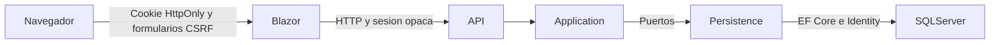

# Acceso e inicio multiempresa

## Alcance

Login real, seleccion y cambio de empresa, inicio con contexto autorizado, actividad personal de acceso y cierre de sesion revocable. Blazor no consulta SQL. No incluye transacciones de ventas, inventario, finanzas ni consolidacion gerencial.

## Arquitectura



| Capa | Responsabilidad |
| --- | --- |
| Contracts | Solicitud de acceso, usuario, empresas autorizadas e inicio |
| Application | Puertos de identidad y empresas; validacion de pertenencia antes de consultar o seleccionar |
| Persistence | Identity, consultas EF Core, sesiones y auditoria |
| API | Autenticacion, validacion de DTO, limites de intentos y endpoints delgados |
| Blazor | Cliente HTTP tipado, cookie protegida, formularios, interfaz y preferencias visuales |

## Configuracion local

Ver [configuracion por entorno y secretos](configuracion-y-secretos.md) para copiar ejemplos sin sobrescribir archivos locales, entender precedencia y preparar otro equipo.

Requisitos: .NET 10 SDK, Node.js, SQL Server local y `sqlcmd`. El servidor SQL es localhost y la base se llama NEROSERP. Se utiliza autenticacion integrada de Windows.

La configuracion local se guarda en User Secrets del proyecto API, con identificador `neros-api-desarrollo` y clave `ConnectionStrings:Neros`. No copiarla a archivos versionados. Para modificarla sin mostrarla ni incluirla en historial:

```powershell
$conexionSegura = Read-Host 'Cadena de conexion local para NEROSERP' -AsSecureString
$puntero = [Runtime.InteropServices.Marshal]::SecureStringToBSTR($conexionSegura)
try {
    $valor = [Runtime.InteropServices.Marshal]::PtrToStringBSTR($puntero)
    @{ 'ConnectionStrings:Neros' = $valor } | ConvertTo-Json | dotnet user-secrets set --project .\Neros.Api
} finally {
    [Runtime.InteropServices.Marshal]::ZeroFreeBSTR($puntero)
    Remove-Variable valor, conexionSegura, puntero -ErrorAction SilentlyContinue
}
```

La configuracion de desarrollo solicita cifrado y acepta el certificado local. Esa excepcion no debe trasladarse a produccion. La cuenta Windows que inicia la API es la que SQL Server autoriza.

```powershell
npm ci
npm run css:build
dotnet build .\Neros.slnx -v minimal
sqlcmd -S localhost -E -C -b -i .\database\scripts\000_crear_base.sql
sqlcmd -S localhost -E -C -b -d NEROSERP -i .\database\scripts\001_identity_empresas.sql
```

El script 001 se aplica una sola vez sobre una base vacia. No ejecutar si ya fue instalado. Ver [procedimiento SQL](../../database/README.md).

## Alta inicial

```powershell
dotnet run --project .\Neros.Api --launch-profile http -- --inicializar-admin
```

Ejecutar personalmente en una terminal. Solicita correo, nombre, clave oculta y confirmacion, codigo, razon social e identificacion fiscal de la primera empresa. La clave debe tener al menos 12 caracteres, mayuscula, minuscula, numero y simbolo. No existen claves predeterminadas ni registro publico. El alta usa transaccion y se rechaza si ya existen usuarios.

Para crear expresamente al primer administrador global, en lugar del administrador limitado a su empresa:

```powershell
dotnet run --project .\Neros.Api --launch-profile http -- --inicializar-admin --administrador-global
```

La opcion global solo se admite junto al alta inicial y se audita en la misma transaccion. Usa la tabla existente AspNetUserClaims, con ClaimTypes.Role y valor AdministradorGlobal; no requiere cambios de esquema ni scripts de contrasenas. No se concede por correo ni por un valor enviado desde Blazor. Una cuenta activa con ese permiso puede listar, seleccionar y consultar el inicio de todas las empresas activas, incluidas las creadas posteriormente sin membresia explicita. La actividad consultada sigue siendo personal. La desactivacion de usuario o empresa y la retirada del permiso se comprueban en servidor en las siguientes solicitudes. Tras retirar el permiso, solo quedan las membresias explicitas activas.

Este permiso cubre los casos de uso existentes, no funcionalidades futuras. Cada modulo nuevo debera incorporar su politica de autorizacion en servidor; no basta con ocultar o mostrar botones. La gestion y revocacion del permiso son administrativas, sin endpoint publico en esta version. No repetir el alta ni borrar usuarios para concederlo a una cuenta posterior: ese caso requiere un procedimiento administrativo separado.

Para una empresa ficticia local se pueden usar codigo PRUEBA, razon social Neros - Empresa de pruebas e identificacion NO-FISCAL-PRUEBA. No usarla para documentos fiscales reales. La clave siempre se introduce directamente en terminal y nunca se incluye en argumentos, scripts SQL ni documentacion.

Asignar una segunda empresa al usuario existente:

```powershell
dotnet run --project .\Neros.Api --launch-profile http -- --asignar-empresa
```

El comando solicita correo y codigo; si la empresa no existe, solicita sus datos. Acepta roles Administrador, Operador o Consulta. No reemplaza membresias existentes ni reactiva permisos silenciosamente. Estos comandos requieren Development y acceso local de confianza al servidor; no son endpoints HTTP.

## Ejecucion

### Visual Studio

El perfil compartido [Neros.slnLaunch](../../Neros.slnLaunch) inicia Neros.Api y Neros.Blazor, en ese orden. Seleccionar **Neros completo** en el desplegable de inicio de Visual Studio y pulsar F5. Los perfiles http de los proyectos sirven API en http://localhost:5067 y Blazor en http://localhost:5268. Si Blazor tiene seleccionado https, su URL es https://localhost:7087 y necesita certificado de desarrollo confiable; la API tambien conserva el puerto HTTP 5067 en su perfil https.

Si no aparece el perfil, cerrar y volver a abrir la solucion. Segun la version de Visual Studio puede ser necesario habilitar Multi-Project Launch Profiles en Herramientas, Opciones, Caracteristicas en version preliminar. La alternativa es clic derecho en la solucion, Configurar proyectos de inicio, Varios proyectos de inicio: establecer **Iniciar** para Neros.Api y Neros.Blazor, y **Ninguno** para las bibliotecas. La seleccion activa pertenece a preferencias locales del IDE; no se cambia su archivo privado desde el repositorio.

Los usuarios no dependen del IDE: Identity consulta AspNetUsers en SQL Server. Crear una cuenta es persistir datos; ejecutar el sistema es mantener disponibles Blazor, API y SQL. Arrancar solo Blazor no inicia automaticamente la API. El aviso `estado=conexion` indica un fallo al conectar; no demuestra una contrasena incorrecta ni una cuenta inexistente. El servidor registra tipo de fallo y estado HTTP sin correo, contrasena, token ni payload.

Referencia: [Microsoft Learn: varios proyectos de inicio](https://learn.microsoft.com/en-us/visualstudio/ide/how-to-set-multiple-startup-projects?view=visualstudio). El formato del perfil fue validado, pero la seleccion interactiva en Visual Studio debe realizarla el usuario.

### VS Code

En VS Code, abrir Ejecutar y depurar y seleccionar **Neros completo (HTTP)** antes de pulsar F5. Este arranque compuesto inicia API y Blazor; al detener una sesion se detienen ambas. El frontend de esta configuracion esta en http://localhost:5098 y la API en http://localhost:5067. La alternativa **Neros completo (HTTPS)** sirve Blazor en https://localhost:7098 con certificado de desarrollo confiable; su comunicacion local con API sigue usando HTTP.

Las opciones **Neros (HTTP)** y **Neros (HTTPS)** arrancan solo Blazor y necesitan una API ya disponible. Si se ejecuta unicamente el frontend, el login puede mostrar servicio no disponible. Crear el administrador con el comando de alta tampoco deja la API ejecutandose: ese comando termina al guardar la cuenta.

Alternativa mediante comandos, con puertos definidos por los perfiles de cada proyecto:

En dos terminales:

```powershell
dotnet run --project .\Neros.Api --launch-profile http
```

```powershell
dotnet run --project .\Neros.Blazor --launch-profile http
```

Frontend: http://localhost:5268. API: http://localhost:5067. `Api:BaseUrl` debe coincidir con la direccion de la API. Usar otro puerto si alguno esta ocupado y actualizar esa configuracion.

## Modelo SQL

| Tabla | Proposito |
| --- | --- |
| AspNetUsers | Usuario global Identity, nombre, activo, hash, bloqueo y sello de seguridad |
| AspNetUserClaims / Logins / Tokens | Almacenamiento estandar Identity; no implica que MFA o acceso externo esten implementados |
| Empresas | Identificador GUID, codigo unico, razon social, identificacion y estado |
| UsuariosEmpresas | Clave compuesta usuario/empresa, rol y estado de la membresia |
| Sesiones | Hash SHA-256 de token aleatorio de 256 bits, usuario, sello de seguridad y vencimiento |
| EventosAcceso | Usuario opcional, empresa opcional, fecha UTC y accion |

Los identificadores de usuario los genera Identity como GUID de texto. SQL Server puede advertir sobre la longitud teorica de claves compuestas de Identity; no suministrar identificadores arbitrariamente largos. Los proveedores de login externo y MFA quedan fuera de esta entrega.

## Contrato HTTP

| Metodo y ruta | Acceso | Resultado |
| --- | --- | --- |
| POST /api/acceso/login | Anonimo limitado | 200 con sesion; 400 validacion; 401 rechazo generico; 429 limite |
| GET /api/acceso/yo | Sesion valida | Usuario actual |
| POST /api/acceso/logout | Sesion valida | 204 y revocacion |
| GET /api/empresas | Sesion valida | Solo membresias activas de usuario y empresa activos |
| POST /api/empresas/{id}/seleccionar | Pertenencia activa | Empresa y auditoria; 404 sin acceso |
| GET /api/empresas/{id}/inicio | Pertenencia activa | Empresa y ultimos 8 eventos personales; 404 sin acceso |

La API recibe la sesion en Authorization Bearer. El token no se expone a JavaScript: el servidor Blazor lo conserva dentro de su cookie cifrada y firmada con Data Protection. Nunca registrar ese header, cookies ni respuestas de login.

## Seguridad

- Cookie HttpOnly, SameSite=Lax y Secure obligatorio fuera de Development; expiracion absoluta, sin renovacion deslizante.
- Sesion ordinaria: 8 horas y cookie de sesion. Mantener sesion: 7 dias y cookie persistente.
- Logout elimina la sesion en SQL; un token copiado deja de ser valido.
- La API comprueba vencimiento, usuario activo, bloqueo y sello en cada solicitud autenticada.
- La empresa seleccionada en la cookie es contexto de navegacion, nunca una autorizacion. Application y Persistence verifican la membresia en cada consulta.
- Los tres roles tienen acceso al inicio y a su propia actividad; no otorgan permisos transaccionales que aun no existen.
- Formularios de login, cambio de empresa y logout exigen antiforgery.
- Identity bloquea durante 15 minutos tras 5 intentos fallidos. Blazor limita a 10 intentos por IP/minuto; la API a 60 por IP/minuto. El limite de API agrupa solicitudes si Blazor opera como intermediario unico.
- Fallos de acceso desconocido y clave incorrecta producen el mismo rechazo. No hay enumeracion publica de empresas.
- Sin SQL concatenado con entrada de usuario, sin hash de clave manual y sin acceso a DB desde Blazor.
- Respuestas web y API no se almacenan en cache. La interfaz no muestra excepciones internas.
- Ante caida de API, las consultas y cambios muestran error, sin datos sustitutos. El cierre informa si no pudo revocar y permite reintentarlo.

## Interfaz

Login y paginas de trabajo usan SSR; los formularios funcionan sin JavaScript. JS agrega preferencia de tema, mostrar clave, fechas locales, busqueda de empresas y bloqueo del doble envio. El login usa fetch con FormData y antiforgery hacia /sesion/entrar, con Accept application/json: devuelve 204 y cookie al aceptar, o JSON con estado y codigo HTTP al rechazar (400, 401, 429, 503 o 504). Credenciales incorrectas y errores de red se muestran en la pagina sin recargarla; solo un acceso correcto navega a empresas. El correo inexistente y la clave incorrecta comparten mensaje. Sin JavaScript se conserva el POST y las redirecciones tradicionales. El token de API nunca se devuelve al navegador.

Desde 2026-09-13, el login permite recordar el correo mediante consentimiento expreso: es un dato personal, se conserva en localStorage de ese navegador hasta desmarcar la opcion o borrar datos del sitio. No guarda contrasenas ni tokens. No usar esa opcion ni mantener sesion en equipos compartidos. Recordar correo no activa la sesion persistente.

El tema sigue `prefers-color-scheme` por defecto. El usuario puede elegir sistema, claro u oscuro; la preferencia se sincroniza entre pestañas. El script inicial se carga antes del CSS para evitar destellos. Los iconos Lucide se sirven localmente. Manrope se solicita a Google Fonts con fallback local; revisar autoalojamiento para instalaciones sin internet o con restricciones de privacidad.

Las transiciones de entrada duran 220 ms y la respuesta de botones 160 ms. Las acciones por teclado no tienen transicion de entrada; `prefers-reduced-motion` elimina desplazamientos. El estado de empresa esta visible y los modulos pendientes no simulan operacion.

## Verificacion

```powershell
dotnet test .\tests\Neros.Tests\Neros.Tests.csproj -v minimal
graphify update .
```

Las pruebas crean y eliminan exclusivamente una base con prefijo NerosTests_ y GUID aleatorio. Requieren permisos de creacion de bases. `NEROS_TEST_SERVER` puede indicar otro servidor Windows de pruebas. Nunca apuntan a NEROSERP para sembrar datos.

La prueba de navegador usa Playwright y Microsoft Edge en Windows. En otros sistemas requiere Chromium instalado mediante el script Playwright generado por el paquete. Las capturas se escriben en `.impeccable/review/`, con datos marcados como prueba y sin claves ni tokens.

## Produccion pendiente

Configurar HTTPS en ambos hosts, `Api:BaseUrl` HTTPS, certificado SQL confiable, secretos gestionados, permisos SQL minimos, llaves Data Protection persistentes y protegidas, backups y retencion de auditoria. Configurar proxies de confianza antes de interpretar IP reenviadas. Evaluar limites distribuidos al escalar horizontalmente.

Pendientes funcionales: administracion web de usuarios y permisos, recuperacion de clave verificada, MFA, permisos por accion, sucursales, consolidacion autorizada y modulos transaccionales. No publicar como un ERP transaccional terminado.