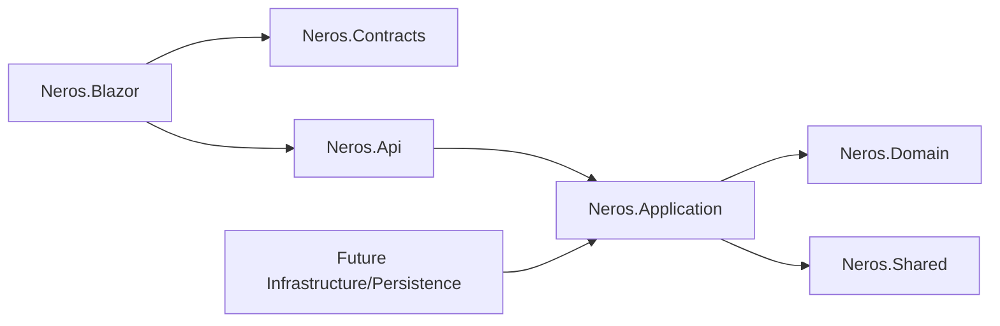

# Architecture Blueprint Generator - Neros

Generate architecture documentation for the new Neros system, not the previous monolith.

## Inputs

- `AGENTS.md`, `CONVENTIONS.md`, `Neros.slnx`.
- `graphify-out/GRAPH_REPORT.md` or Graphify query results.
- Relevant project files and nearby implementations.

## Blueprint Sections

1. **System Context**: what Neros does and which users/systems interact with it.
2. **Solution Topology**: `Neros.Blazor`, `Neros.Api`, `Neros.Application`, `Neros.Domain`, `Neros.Contracts`, `Neros.Shared`, future infrastructure/persistence.
3. **Dependency Direction**: allowed and forbidden references.
4. **Runtime Flow**: Blazor -> API -> Application -> Domain -> port -> infrastructure.
5. **Contracts**: DTO naming, request/response boundaries, validation ownership.
6. **Data Strategy**: SQL Server, EF Core as mapper/query tool, versioned scripts in `database/<modulo>/` applied by `tools/Neros.Database.Deploy` (ADR-0004).
7. **Security**: Identity, roles, resource permissions, tenant/sucursal scoping, audit, secrets.
8. **Realtime/Jobs**: SignalR hubs, groups, background jobs, retry and idempotency concerns.
9. **Frontend**: Blazor Web App, Tailwind CSS, operational ERP UX, accessibility, no Bootstrap/jQuery.
10. **Validation**: build, CSS build, tests when present, Graphify update.

## Viewpoints To Include When Relevant

### Static View

- Projects and dependencies.
- Source folders and ownership.
- Public contracts and DTO packages.

### Runtime View

- Request lifecycle.
- Authentication and authorization checks.
- Transaction and external integration boundaries.
- SignalR event flow or background job flow.

### Data View

- Main aggregates/entities/value objects.
- Read models or DTO projections.
- SQL Server schema ownership and script path.
- Audit and tenant/resource scoping.

### Deployment/Operations View

- Blazor/API hosting assumptions.
- Configuration and secrets boundary.
- Jobs, retries, idempotency and observability.

## Required Diagram

Use a small Mermaid diagram when useful:



## Legacy Boundary

If the old system is mentioned, label it as **functional reference**. Do not describe MVC Areas, `Servicios/*`, `EQContext`, Bootstrap or jQuery as target architecture.

## Output Quality

- Be specific to files/projects that exist now.
- Distinguish current state from target state.
- Include risks and missing pieces.
- Include exact validation commands, but do not run them if the user disallows local execution.

## Common Blueprint Mistakes

| Mistake | Correction |
|---|---|
| Describing hoped-for projects as existing | Label as future/target state |
| Omitting Contracts | Show DTO/request/response boundaries |
| Omitting authorization | Add policy/resource/tenant checks |
| Showing Blazor -> database | Route through API/Application |
| Treating Graphify as always fresh | Note report date/commit and update need |

## Output Template

```text
# Architecture: <topic>

## Current State
<facts with files/projects>

## Target Shape
<layered design>

## Flows
<request/data/event flow>

## Risks And Gaps
<security/data/ops/missing pieces>

## Validation
<commands or pending checks>
```