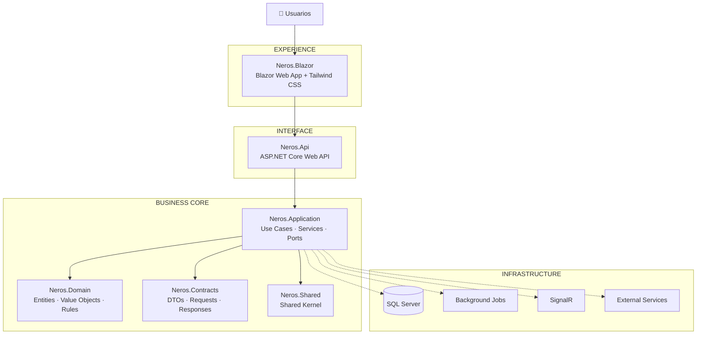
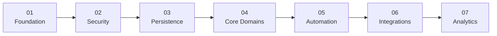

<div align="center">


### El ERP que conecta operación, finanzas y crecimiento.

<p>
  <strong>Neros centraliza procesos empresariales, automatiza flujos y convierte datos dispersos<br/>
  en información trazable para tomar mejores decisiones.</strong>
</p>

<br/>

<a href="#-visión-del-producto">
  
</a>
<a href="#-arquitectura">
  
</a>
<a href="#-estado-del-proyecto">
  
</a>

<br/><br/>


<br/><br/>

<sub>
MODULAR · TRAZABLE · MULTIEMPRESA · API-FIRST · AUTOMATIZABLE · ESCALABLE
</sub>

</div>

---

<div align="center">

## ⚡ Neros convierte procesos aislados en una sola operación conectada

No más información fragmentada entre áreas, procesos manuales difíciles de auditar o sistemas que crecen sin control.

**Una plataforma. Un modelo operativo. Una fuente confiable de información.**

</div>

<br/>

<table>
<tr>
<td width="33%" align="center">

### 🧭 CONTROL

Usuarios, roles, permisos, aprobaciones y auditoría sobre los procesos críticos.

</td>
<td width="33%" align="center">

### 🔗 CONEXIÓN

Finanzas, compras, ventas, inventarios, producción y talento trabajando sobre la misma plataforma.

</td>
<td width="33%" align="center">

### ⚙️ AUTOMATIZACIÓN

Menos tareas repetitivas mediante eventos, jobs, notificaciones y procesos automáticos.

</td>
</tr>
</table>

---

# ✦ Visión del producto

> ### Neros no está diseñado para ser “otro software administrativo”.
>
> Está diseñado para convertirse en el **núcleo operativo digital de una empresa**.

Cada módulo comparte una misma filosofía:

- **Datos consistentes**
- **Procesos trazables**
- **Responsabilidades claras**
- **Aprobaciones controladas**
- **Integraciones desacopladas**
- **Automatización progresiva**
- **Arquitectura preparada para crecer**

El objetivo es que cada operación pueda contar su propia historia:

```text
SOLICITUD
   ↓
VALIDACIÓN
   ↓
APROBACIÓN
   ↓
OPERACIÓN
   ↓
DOCUMENTO
   ↓
MOVIMIENTO
   ↓
CONTABILIZACIÓN
   ↓
AUDITORÍA
   ↓
ANÁLISIS
```

---

# ◈ Ecosistema Neros

<div align="center">

### Una plataforma empresarial construida por dominios.

</div>

<table>
<tr>
<td width="50%" valign="top">

## 🏢 Neros Core

**Administración y gobierno**

- Empresas
- Usuarios
- Roles
- Permisos
- Terceros
- Parametrización
- Auditoría
- Configuración global

</td>
<td width="50%" valign="top">

## 💰 Neros Finance

**Finanzas y control**

- Contabilidad
- Tesorería
- Cartera
- Cuentas por pagar
- Flujo de caja
- Presupuesto
- Estados financieros
- Reportes

</td>
</tr>

<tr>
<td width="50%" valign="top">

## 📦 Neros Supply

**Compras e inventarios**

- Requisiciones
- Aprobaciones
- Cotizaciones
- Proveedores
- Órdenes de compra
- Bodegas
- Existencias
- Traslados

</td>
<td width="50%" valign="top">

## 🧾 Neros Sales

**Ventas y facturación**

- Clientes
- Cotizaciones
- Pedidos
- Despachos
- Facturación
- Cartera
- Notas
- Seguimiento comercial

</td>
</tr>

<tr>
<td width="50%" valign="top">

## 🏭 Neros Manufacturing

**Producción**

- Órdenes de producción
- Materiales
- Alistamiento
- Consumos
- Operaciones
- Calidad
- Trazabilidad
- Costos

</td>
<td width="50%" valign="top">

## 👥 Neros People

**Talento humano**

- Empleados
- Contratos
- Novedades
- Nómina
- Vacaciones
- Prestaciones
- Liquidaciones
- Gestión laboral

</td>
</tr>

<tr>
<td width="50%" valign="top">

## 📊 Neros Analytics

**Información y decisiones**

- Indicadores
- Dashboards
- Reportes
- Consultas
- Alertas
- Seguimiento
- Análisis operativo

</td>
<td width="50%" valign="top">

## 🔌 Neros Connect

**Integraciones y automatización**

- API
- Servicios externos
- Facturación electrónica
- Webhooks
- Jobs
- SignalR
- Eventos
- Notificaciones

</td>
</tr>
</table>

---

# 🎯 Lo que diferencia a Neros

<table>
<tr>
<td width="25%" align="center">

### 01

## Modular

Cada dominio puede evolucionar sin convertir el ERP en un bloque inmanejable.

</td>
<td width="25%" align="center">

### 02

## Trazable

Las operaciones críticas conservan origen, responsables, cambios y consecuencias.

</td>
<td width="25%" align="center">

### 03

## Integrable

Una API propia permite conectar Neros con servicios empresariales externos.

</td>
<td width="25%" align="center">

### 04

## Evolutivo

La arquitectura permite incorporar nuevos módulos sin rehacer la plataforma.

</td>
</tr>
</table>

<br/>

```text
┌──────────────────────────────────────────────────────────────┐
│                      PRINCIPIO NEROS                         │
├──────────────────────────────────────────────────────────────┤
│                                                              │
│   El negocio define las reglas.                              │
│   La arquitectura protege esas reglas.                       │
│   La tecnología puede cambiar sin destruir el negocio.       │
│                                                              │
└──────────────────────────────────────────────────────────────┘
```

---

# 🧠 Diseñado para toda la organización

<table>
<tr>
<td width="25%" valign="top">

### 👔 Dirección

Visión consolidada del negocio para evaluar resultados, riesgos y oportunidades.

</td>
<td width="25%" valign="top">

### 💼 Finanzas

Información confiable, trazable y relacionada con la operación real.

</td>
<td width="25%" valign="top">

### 🏗️ Operaciones

Procesos conectados desde la solicitud inicial hasta la ejecución y seguimiento.

</td>
<td width="25%" valign="top">

### 💻 Tecnología

Una base modular, desacoplada y mantenible para crecer sin perder control.

</td>
</tr>
</table>

---

# 🛡️ Trazabilidad por diseño

Neros busca responder preguntas operativas sin depender de reconstrucciones manuales.

| Pregunta | Neros debe poder responder |
|---|:---:|
| ¿Quién realizó la operación? | ✓ |
| ¿Cuándo se realizó? | ✓ |
| ¿Qué información cambió? | ✓ |
| ¿Quién aprobó? | ✓ |
| ¿Qué documento originó el proceso? | ✓ |
| ¿Qué documentos fueron generados? | ✓ |
| ¿Qué módulo resultó afectado? | ✓ |
| ¿Cuál fue el impacto financiero? | ✓ |
| ¿Existe evidencia de auditoría? | ✓ |

---

# 🏗️ Arquitectura

<div align="center">

### El dominio empresarial permanece en el centro.

La interfaz, la persistencia y las integraciones existen alrededor del negocio, no al revés.

</div>



---

## 🧩 Estructura de solución

```text
Neros
│
├── Neros.Blazor
│   └── Experience Layer
│       ├── Pages
│       ├── Components
│       ├── Layouts
│       └── UI
│
├── Neros.Api
│   └── Interface Layer
│       ├── Endpoints
│       ├── Controllers
│       └── Middleware
│
├── Neros.Application
│   └── Application Layer
│       ├── Use Cases
│       ├── Services
│       ├── Commands
│       ├── Queries
│       └── Ports
│
├── Neros.Domain
│   └── Domain Layer
│       ├── Entities
│       ├── Value Objects
│       ├── Aggregates
│       └── Business Rules
│
├── Neros.Contracts
│   ├── Requests
│   ├── Responses
│   └── DTOs
│
└── Neros.Shared
    └── Shared Kernel
```

---

# 🧱 Stack tecnológico

<div align="center">


<br/><br/>


</div>

<br/>

| Área | Tecnología | Propósito |
|---|---|---|
| **Runtime** | .NET 10 | Base tecnológica |
| **Frontend** | Blazor Web App | Experiencia web |
| **UI** | Tailwind CSS | Sistema visual |
| **Backend** | ASP.NET Core Web API | Servicios HTTP |
| **Dominio** | Clean Architecture | Aislamiento de reglas empresariales |
| **Persistencia** | SQL Server | Datos empresariales |
| **Tiempo real** | SignalR | Eventos y actualización reactiva |
| **Conocimiento** | Graphify | Navegación arquitectónica |
| **Versionamiento** | Git | Historial y colaboración |

---

# ⚙️ Principios de ingeniería

<div align="center">

| | |
|---|---|
| **Business Rules** › Frameworks | El negocio no depende de la tecnología |
| **Domains** › Screens | Los módulos se modelan como dominios |
| **Contracts** › Coupling | Las capas se comunican mediante contratos |
| **Traceability** › Assumptions | Los hechos deben poder reconstruirse |
| **Automation** › Repetition | Lo repetitivo debe automatizarse |
| **Security** › Convenience | La seguridad es una restricción arquitectónica |

</div>

### Reglas fundamentales

- `Neros.Domain` permanece libre de dependencias de infraestructura.
- La interfaz nunca accede directamente a persistencia.
- `Neros.Application` contiene los casos de uso.
- `Neros.Contracts` define los contratos de comunicación.
- Tailwind CSS actúa como base del sistema visual.
- Los secretos nunca se almacenan en el repositorio.
- Los cambios de base de datos son versionables y auditables.
- Los nuevos módulos respetan límites de dominio definidos.
- Las decisiones arquitectónicas relevantes deben documentarse.
- Las integraciones externas deben permanecer desacopladas del core.

---

# 🤖 Desarrollo asistido por IA

Neros utiliza **Graphify** para construir un mapa navegable del código y sus relaciones.

Esto permite que desarrolladores y agentes puedan entender:

```text
MÓDULOS
   │
   ├── clases
   ├── dependencias
   ├── relaciones
   ├── llamadas
   ├── flujos
   └── arquitectura
```

Consultar la arquitectura:

```powershell
graphify query "estructura actual de Neros"
```

Actualizar el grafo:

```powershell
graphify update .
graphify cluster-only .
```

Generar el árbol navegable:

```powershell
graphify tree `
    --graph graphify-out\graph.json `
    --output graphify-out\GRAPH_TREE.html `
    --label "Neros"
```

---

# 🚦 Estado del proyecto

<div align="center">


</div>

<br/>

```text
FOUNDATION
████████████████████  100%

ARCHITECTURE
████████████████████  100%

DESIGN SYSTEM
██████████████░░░░░░   En evolución

BUSINESS DOMAINS
████████░░░░░░░░░░░░   Incorporación progresiva

AUTOMATION
████░░░░░░░░░░░░░░░░   Roadmap

INTEGRATIONS
████░░░░░░░░░░░░░░░░   Roadmap
```

---

# 🗺️ Roadmap



### Etapa 01 — Foundation
`DONE`

Arquitectura base, solución, API, frontend y convenciones.

### Etapa 02 — Security
`IN PROGRESS`

Identity, roles, permisos, políticas, auditoría y contexto multiempresa.

### Etapa 03 — Persistence
`IN PROGRESS`

Persistencia empresarial, acceso a datos y estrategia de versionamiento.

### Etapa 04 — Business Domains
`NEXT`

Implementación progresiva de administración, finanzas, supply, ventas, producción y talento.

### Etapa 05 — Automation
`PLANNED`

Jobs, eventos, notificaciones y procesos asincrónicos.

### Etapa 06 — Integrations
`PLANNED`

Servicios externos, facturación electrónica, APIs y ecosistemas empresariales.

### Etapa 07 — Analytics
`PLANNED`

Indicadores, dashboards y herramientas de análisis.

---

# 🚀 Desarrollo local

### Requisitos

```text
.NET 10 SDK
Node.js
npm
SQL Server
Git
Graphify     # opcional
```

### Preparar

```powershell
cd .\Neros

npm install
npm run css:build

dotnet restore .\Neros.slnx
dotnet build .\Neros.slnx -v minimal
```

---

# 🌐 La visión a largo plazo

<div align="center">

### Neros debe poder crecer junto con la empresa que lo utiliza.

</div>

La plataforma está diseñada para evolucionar hacia un ecosistema donde:

- los procesos empresariales estén conectados;
- cada operación conserve trazabilidad;
- las reglas puedan configurarse sin destruir el core;
- las integraciones sean una capacidad nativa;
- la automatización reduzca trabajo manual;
- la información pueda convertirse en decisiones;
- nuevos dominios puedan incorporarse sin reconstruir el ERP.

<br/>

<div align="center">

## **NEROS**

### Operación conectada. Información confiable. Crecimiento sin fricción.

<br/>


<br/><br/>

<sub>
© Neros · Enterprise Resource Planning
</sub>


</div>
