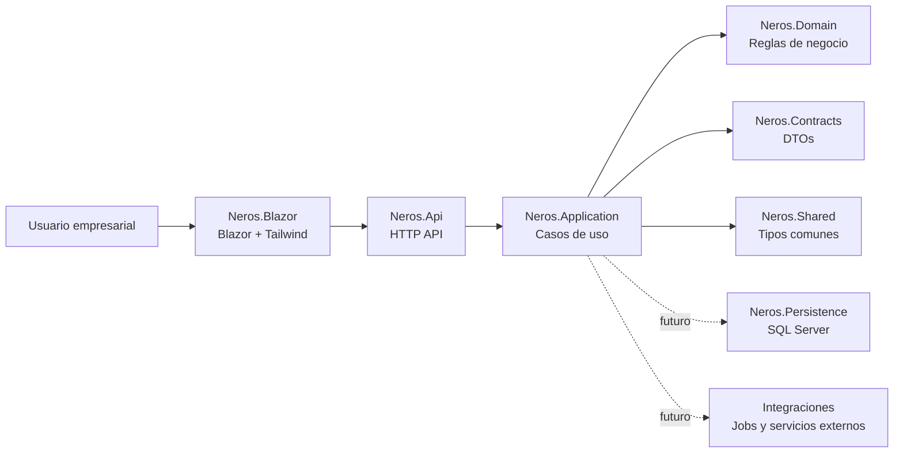

<div align="center">

# Neros

### Control empresarial, trazabilidad y crecimiento sobre una base moderna.


<br />

**Neros** es una plataforma ERP full .NET para centralizar operacion, finanzas, inventario, automatizacion e integraciones en una arquitectura modular, segura y lista para escalar.

<br />

| Plataforma modular | UI moderna | Seguridad preparada | IA para desarrollo |
|--------------------|------------|---------------------|--------------------|
| Dominios separados | Blazor + Tailwind | Identity, auditoria y permisos | Graphify + agentes locales |

</div>

---

## En Una Frase

Neros convierte la operacion empresarial en una plataforma integrada: datos confiables, procesos trazables, modulos extensibles y una experiencia web rapida para equipos que necesitan decidir y ejecutar sin friccion.

## Propuesta Comercial

| Para la empresa | Para operaciones | Para tecnologia |
|-----------------|------------------|-----------------|
| Control sobre procesos criticos, usuarios, permisos y datos. | Flujos conectados entre inventario, facturacion, tesoreria, nomina y reportes. | Arquitectura por capas, API propia, dominio limpio y base preparada para crecer. |

## Capacidades Objetivo

| Frente | Modulos previstos | Resultado esperado |
|--------|-------------------|--------------------|
| Gestion | Administracion, terceros, permisos, configuracion | Gobierno central del sistema. |
| Finanzas | Contabilidad, tesoreria, cartera, flujo de caja | Informacion financiera ordenada y auditable. |
| Operacion | Inventarios, compras, ventas, produccion, salud, hotelero | Trazabilidad del ciclo operativo. |
| Talento | Nomina, contratos, novedades, liquidaciones | Procesos laborales controlados. |
| Integracion | Facturacion electronica, reportes, servicios externos | Conectividad con ecosistemas fiscales y empresariales. |
| Automatizacion | Jobs, notificaciones, SignalR, procesos en segundo plano | Menos tareas manuales y mejor seguimiento. |

## Diferenciadores

| Diferenciador | Que aporta |
|---------------|------------|
| Arquitectura limpia | Separa UI, API, Application, Domain y Contracts desde el inicio. |
| Escalabilidad modular | Cada dominio puede crecer sin convertir el sistema en un bloque rigido. |
| Frontend actual | Blazor Web App con Tailwind CSS, sin Bootstrap como dependencia visual. |
| Seguridad de base | Preparado para permisos por empresa, auditoria, secretos externos y multitenancy. |
| Desarrollo asistido | Graphify mantiene un mapa navegable de relaciones y arquitectura. |

## Arquitectura



```text
Neros/
|-- Neros.slnx
|-- Neros.Blazor/        # Frontend Blazor + Tailwind CSS
|-- Neros.Api/           # API HTTP para UI e integraciones
|-- Neros.Application/   # Casos de uso y puertos de aplicacion
|-- Neros.Domain/        # Entidades, value objects y reglas de negocio
|-- Neros.Contracts/     # DTOs, requests y responses
`-- Neros.Shared/        # Tipos transversales
```

## Stack

| Capa | Tecnologia | Rol |
|------|------------|-----|
| Frontend | Blazor Web App + Tailwind CSS | Experiencia web moderna y modular. |
| Backend | ASP.NET Core Web API | Entrada HTTP para UI e integraciones. |
| Core | .NET 10 + Clean Architecture | Separacion de negocio, contratos y casos de uso. |
| Datos | SQL Server | Motor objetivo para persistencia empresarial. |
| Conocimiento | Graphify | Mapa arquitectonico consultable por IA y equipo. |

## Estado Actual

| Estado | Detalle |
|--------|---------|
| Base tecnica | Solucion `Neros.slnx`, Core, API y Blazor creados. |
| UI | Tailwind CSS configurado como sistema visual. |
| IA | Agentes, skills y Graphify listos para asistir el desarrollo. |
| Modulos | Incorporacion progresiva por dominios de negocio. |

## Desarrollo

```powershell
cd .\Neros
npm install
npm run css:build
dotnet build .\Neros.slnx -v minimal
```

Consultar arquitectura:

```powershell
graphify query "estructura actual de Neros"
```

Actualizar grafo:

```powershell
graphify update .
graphify cluster-only .
graphify tree --graph graphify-out\graph.json --output graphify-out\GRAPH_TREE.html --label "Neros"
```

## Principios

- Tailwind CSS como base visual del frontend.
- Blazor separado de persistencia e infraestructura.
- `Neros.Domain` libre de dependencias externas.
- Contratos compartidos en `Neros.Contracts`.
- Scripts SQL manuales versionados para cambios de base de datos.
- Cero secretos, tokens o credenciales en archivos versionados.

---

<div align="center">

### Neros es claridad operativa sobre una arquitectura preparada para evolucionar.

</div>

